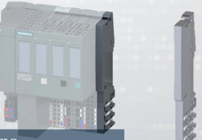

# 1500 PLC编程与应用培训课程
## 1500系统
### PLC系统简介
#### PLC的由来
- 自动化生产线--对生产效率的不断追求的结果
#### PLC的发展历史
- 起源-美国DEC公司20实际70年代初
- 实用化----20实际70年代~ 20世纪80年代初
- 快速发展----20世纪80年代~ 20世纪90年代中期  - 西门子S5系列
- 进步和完善----20世纪末期~至今   - 西门子S7系列
#### 常见PLC系统的组成
- PM/PS
- CPU
- SM    - DI/DO/AI/AO
- IM    
- HMI
- 等
#### 电源模块 PM / PS
##### PM/电源模块
- 为CPU、信号模块及其他扩展模块、其他用电设备（例如传感器）提供工作供电。

##### PS/电源模块(system power supply)
- 为CPU、信号模块及其他扩展模块提供工作供电

##### PM/PS区别
- PM可以给其他用电设备（如传感器）供电
- PM有DC24V接线端子，可以外接给其他用电设备
- PS通过背板连接器供电

#### 1500 CPU
SIMATIC S7-1500具有高速背板总线、PROFINET性能和极短响应时间，CPU命令处理时间可以达到1ns，可在生产过程中实现极高的生产力和产品质量
##### S7-1500 CPU的家族成员
###### 常规系列
- 1511
- 1512
- 1513
- 1515
- 1516
- 1517
- 1518

###### 紧凑型
- 集成
- 1511C
- 1512C
- ...

###### 运动控制（T）CPU

- 1515T
- 1517T

###### 冗余（R/H）CPU

- 1515R
- 1517H

####  1500 信号模块

##### 工业常见信号的分类

###### 电信号

- 数字信号：分散开的、不存在中间值的量。如开、关， 0， 1。
- 模拟信号：在一定范围连续变化的量，如0~10V。

##### 数字量模块

###### 数字量输入  DI

- 信号电压等级： 信号‘0’: -30到+5V
- 信号电压等级： 信号'1': +11到+30V
- 数字量输入信号的有效时间（输入延时）： 从‘0’到‘1’的最短时间 3ms，从‘1’到‘0’的最短时间是3ms。

###### 数字量输出  DO

##### 模拟量模块

###### 模拟量输入  AI： 温度、流量

###### 模拟量输出  AO：电机、电磁调节阀等

#### 分布式I/O从站 ET200系列

##### ET200 MP系列

高性能，易使用

###### 采用S7-1500的IO模块进行分布式站配置

###### 模块型号少，所有35mm宽的模块均配有统一的前连接器

###### 前连接器的预配合位置可方便的进行预接线

##### ET200 SP系列

体积紧凑、功能强大

###### 无需单独的供电模块形成各个负载组

###### 系统支持永久接线、热插拔、模块空缺运行

###### 更加节省空间的直插式端子，单手接线无需工具

##### ET200 SP HA

- 与SIMATIC PCS7 结合使用

##### ET200 M

- 采用通用的S7-300 I/O模块

##### ET200 S

- 结构紧凑，大量信号点数支持，可扩展模块长度最高可至2米。

##### ET200 iSP

- 用于危险区域的久经验证的本质安全型IO系统

##### ET200 AL

- 坚固耐用的IO，高防护等级，轻松安装于各种位置

  

##### ET200 pro

- 坚固耐用的模块化多功能I/O系统，防护等级为IP65/66/67

##### ET200 eco PN0

- 坚固的块型IO，高防护等级

#### 工业网络 PROFIBUS & PROFINET

### ET200 SP 系统构成及使用

高度灵活的可扩展分布式I/O系统，用于通过现场总线将过程信号连接到上一级控制器

#### 特点

- 紧凑型设计
- 易于使用
- 高性能
- 安全集成
- 多种通信协议
- ...

#### 接口模块IM

- 用于将ET200 SP连接到网络，实现主/从站之间的数据交换

##### PROFIBUS

##### PROFINET

#### 带CPU功能的ET200 SP分布式I/O接口模块

- 集成了一个类似于1511/1512 性能的CPU。

#### ET200 SP 基座单元（BaseUnit）

##### 用于ET200 SP电子模块的机械连接

##### 用于ET200 SP电子模块的电气连接

##### 可以预接线（不带I/O模块）

##### 种类

#### ET200 SP电子模块

##### 信号模块

- DI/DO/AI/AO...
- ST:标准型
- BA:基本型：简化类型，比标准型简单
- HF:高性能型： 比标准型多了一些功能，如诊断
- HS:高速型： 信号处理速度更快

##### 工艺模块

##### 通信模块

#### ET200 SP 服务器模块

##### 服务器模块用于完善ET200 SP的组态

##### 服务器模块包含在接口模块的供货中

##### 有了它背板总线回路才完整