# 西门子300通讯

## 通信概览

### S7-300通信资源分配

#### 描述

S7-300PLC PN接口的CPU和CP包含的通讯服务。如下图所示。

通信资源就是通信双方为了执行通信服务而进行的连接资源和通信任务资源的分配。通信双方的数据交换需要通信资源，由其中的连接资源和通讯任务资源两个参数决定。
连接资源 ：用于在连接期间管理通讯过程，主为2类：S7连接资源和非S7连接资源，如下图所示 。

通讯任务资源：基于连接资源可以执行的通讯任务数量。
例：下图为319-3PN/DP CPU技术数据，16为S7通通信连接源可建的个数，32为通讯任务资源即程序块背景DB的数量。 即多少个的 PUT, GET, BSEND, BRCV, USEND 和 URCV 块能够运行。

注：如果连接资源达到上限后，无法与其他Partner建立连接，同样，超过通讯任务资源，其它连接资源的通讯双方也无法进行通讯。

S7-300CPU S7通信资源与任务资源分配情况：

S7-300 CP 总连接资源分配情况：

\* 总连接资源指同时进行多种协议通信时的最大允许连接数，这里CPU总连接资源指S7通信资源，CP总连接资源包含S7连接资源和S5兼容资源。

**多路复用**

由于S7-300CPU中S7连接资源数的限制，当通过CP卡进行S7相关的通讯服务时，可以激活多路复用功能，即在执行通信资源分配时，支持多路复用的CP和通讯服务，在建立连接时，占用CP多个资源，占用CPU1个连接资源，不支持多路复用的服务和CP，在建立连接时，占用CP1个资源，占用CPU1个资源。 下表列出支持多路复用的服务和CP卡。

| CP              | 多路复用 | 服务                   |
| --------------- | -------- | ---------------------- |
| CP343-1 Advance | 支持     | OP S7双边 S7单边客户端 |
| CP343-1         | 支持     | OP S7双边 S7单边客户端 |
| CP343-1lean     | 不支持   |                        |

#### 举例

针对于 CPU 317-2 PN/DP (订货号：6ES7317-2EK14-0AB0) 和 CP343-1 (订货号：6GK7343-1EX30-0XE0) 的属性列出下面三种类型参数。

- S7 通信
- 开放式通信
- 通信实例数目

下面的表格列出了 CPU 317-2 PN/DP 和 CP343-1 的属性。

| 技术数据          | CPU 317-2 PN/DP 6ES7317-2EK14-0AB0                           | CP343-1 6GK7343-1EX30-0XE0 |
| ----------------- | ------------------------------------------------------------ | -------------------------- |
| 开放式通信资源数  | 16                                                           | 16                         |
| S7 连接资源数     | 32                                                           | 16                         |
| S7 连接资源的限制 | S7 通信资源数最大 16 个 S7 基本通信资源数最大 30 个 PG 或 OP 连接资源数最大 31 个 | 无限制                     |
| 通信实例数目      | 32                                                           | 16                         |

表格 01

#### S7 通信

S7通信是S7系列PLC基于MPI、PROFIBUS、ETHERNET网络的一种优化的通信协议，主要用于S7-300/400PLC之间的通信。

S7-300/400通过以太网接口与S7-200 SMART PLC 之间的S7通讯经过测试是可以成功的，但是需要S7-300/400侧编程调用PUT/GET指令，见表1所示。
表 1 PUT和GET ：

| S7-400 | S7-300 | 描述   | 简要描述         |
| ------ | ------ | ------ | ---------------- |
| SFB 14 | FB 14  | 读数据 | 单边编程读访问。 |
| SFB 15 | FB 15  | 写数据 | 单边编程写访问。 |

S7-300/400根据使用通信接口（集成的PN口或CP343-1/CP443-1）不同，调用的功能块来源也不同。
通信接口为S7-300 集成PN接口时，需要使用Standard Library中PUT/GET指令，如图1所示。

图1 S7-300PN接口需采用Standard Library

通信接口为S7-300 CP通信模块时，需要使用SIMATIC_NET_CP 库中PUT/GET指令，如图2所示。

图2 S7-300 CP模块接口需采用SIMATIC_NET_CP库

S7-400 CPU不区分通信接口，需要使用System Function Blocks 中的SFB14/SFB15指令块，如图3所示。

图3 S7-400 需采用SFB程序块

对于例子中的6ES7317-2EK14-0AB0 CPU 来说，最多可以配置 16 个 S7 连接。PG，OP 和 S7 基本通信共是 16 个连接资源。
通过扩展CP 例子中的6GK7343-1EX30-0XE0 模块建立 16 个 S7 连接。结合CP的多路复用功能，CP组态S7连接时，不论 CP 模块组态的是 1 个还是 16 个 S7连接，仅占用 CPU 的一个资源。这个被占用的 CPU 的 S7 连接是已组态的 S7 连接，而不是额外的 PG, OP 和 S7 基本通信中的 16 个资源。

下表列出了 CPU 317-2 PN/DP + CP343-1组合中， S7 连接的最大数目（未考虑通讯任务资源的情况）。

| CP 模块数    | 每个 CP 可组态 | 每个 CPU 可组态 | 每个 CPU 可组态的其他连接 (PG, OP, S7 基本通信) | 总共 |
| ------------ | -------------- | --------------- | ----------------------------------------------- | ---- |
| 0 (only CPU) | -              | 16              | 16                                              | 32   |
| 1            | 16             | 15              | 16                                              | 47   |
| 2            | 16             | 14              | 16                                              | 62   |
| 3            | 16             | 13              | 16                                              | 77   |
| 4            | 16             | 12              | 16                                              | 92   |

表格 02

#### 开放式通信

在 CPU 中，可以使用 TCON 块建立 16 连接 (TCP, ISO-on-TCP, UDP)。这个数目是不受其他通信服务的限制，且本身不影响任何其他类型的通信。
CP 模块可以配置 16 个开放通信连接。这些资源数是与 S7 连接并行的，CP 模块最大可以建立 32 个连接（包括 S7 连接和开放通信连接）。
CP的开放通信不影响 CPU 的通信资源。如果仅组态 CP 模块的开放通信连接，是不占用 CPU 的 S7 连接的。AG_SEND/AG_RECV 块是用来读取/写入数据的。通过这种方式不使用任何CPU 资源。功能块调用的最大数量不受限制。

#### 通信实例

在 CPU 中进行 S7 通信，可以同时运行多达 32 个实例。超过 32 个实例的话会报错。当CPU进行更多的 S7 连接任务，一个 S7 连接的实例任务完成后可以使用另一个 S7 连接实例。
CP 模块可以最多运行16个实例。例如可以发送和接收 8 组 S7 连接，或者，仅发送或者仅接收 16 组 S7 连接。不能同时发送和接收 16 组 S7 连接。CP 模块不支持轮询，16 个实例数目就是最大值。 

***************************************

### 以太网、工业以太网及PROFINET的区别

- 以太网(Ethernet)通常指的是由[Xerox](https://baike.baidu.com/view/1054050.htm)公司创建并由Xerox、[Intel](https://baike.baidu.com/view/2396.htm)和[DEC](https://baike.baidu.com/view/270611.htm)公司联合开发的基带[局域网](https://baike.baidu.com/view/788.htm)规范，是当前应用最普遍的[局域网](https://baike.baidu.com/view/788.htm)技术。它不是一种具体的网络，是一种[技术规范](https://baike.baidu.com/view/483340.htm)。该标准主要定义了在[局域网](https://baike.baidu.com/view/788.htm)（[LAN](https://baike.baidu.com/view/14702.htm)）中采用的电缆类型和信号处理方法等内容

- 工业以太网通常是指应用于工业控制领域的[以太网技术](https://baike.baidu.com/view/2902988.htm)，在技术上与普通以太网技术相兼容，但对具体产品和应用都有不同要求。由于产品要在工业现场使用，对产品的材料、强度、适用性、可互操作性、可靠性、抗干扰性等有较高要求；而且工业以太网是面向工业生产控制的，对数据的实时性、确定性、可靠性等有极高的要求。

- Profinet 由PROFIBUS国际组织（PROFIBUS International，PI）推出，是基于工业以太网技术的自动化[总线标准](https://baike.baidu.com/view/672343.htm)。PROFINET为自动化通信领域提供了一个完整的网络解决方案，囊括了诸如实时以太网、[运动控制](https://baike.baidu.com/view/1501678.htm)、分布式自动化、故障安全以及网络安全等当前自动化领域的内容。 

  简单的说，以太网是一种局域网规范，工业以太网是应用于工业控制领域的以太网技术，Profinet是一种在工业以太网上运行的实时技术规范。
  
  

*********************************************
### Profinet通讯中Controller和Device的区别

在做Profinet IO 通讯时，最常见到的两种角色是Control 和Device ，又称为IO控制器和IO设备。IO 控制器是一个控制设备 , 连接一个或多个 IO 设备 ( 现场设备 ) ，常见的IO控制器就是PLC，如S7-300、S7-1500 可编程控制器。IO设备是一个现场设备，常见的IO设备就是分布式IO，如ET200MP PN设备等。

***********************************************
### 通讯中Server和Client的区别

例如在使用TCP通讯建立连接时采用客户端服务器模式，这种模式又常常被称为主从式架构，简称为C/S结构，属于一种网络通讯架构，将通讯的双方以客户端（Client ）与服务器 (Server) 的身份区分开来。使用C/S结构的通信常见的还有S7通信， ISO-on-TCP通信。

服务器的特征：被动角色，等待来自客户端的连接请求，处理请求并回传结果。

客户端的特征：主动角色，发送连接请求，等待服务器的响应。 

端口：是指用于区分不同服务的逻辑编号，端口号的范围从0到65535，SIEMENS设备的开放式以太网通信通常使用编号为2000~5000范围内端口。

客户端侧在配置TCP连接时，必须设置服务器IP地址及端口号，自身使用的端口号如果没有明确指定，则由设备自动分配。

服务器侧在配置TCP连接时，必须设置服务器使用的端口号，客户端IP地址及端口号为可选项。

图 1在TIA软件中TCP服务器侧连接参数设置

图 2 在STEP7 V5.x 软件中TCP客户端侧连接参数设置

***********************************************
### I-DEVICE（智能设备）是什么
I-DEVICE 又叫做智能设备或智能IO设备，其本身是上层IO控制器的IO设备，又作为下层IO设备的IO控制器。

一个PN智能设备功能不但可以作为一个CPU处理生产工艺的某一过程，而且可以和IO控制器之间交换过程数据，因此，智能设备作为一个IO设备连接一个上层IO控制器，智能设备的CPU通过自身的程序处理某段工艺过程，相应的过程值发送至上层的IO控制器再做相关的处理。

#### 应用与优势

采用智能设备可以实现：

· 分布式处理

一个复杂的自动化任务可以划分为多个子任务，由于子任务的简化使得过程处理更加容易。

· 分割子过程

复杂和分布广泛的过程可以细分为几个子过程。这些子过程可以存储在各自的Step7项目中，且可以合并为一个完整的项目。

· 知识保护

智能设备的接口描述使用GSD文件而不是Step7项目，这样用户的知识-用户程序得以保护。

智能设备具有如下优点：

· 实现简单的IO控制器的连接，无需额外的软件工具

· 除了实时通信，还支持等时实时通信

· 由于几个智能设备具有计算能力，这样对IO控制器的计算能力要求也就减少了

· 由于处理本地过程数据，从而减少了通信负荷

· 在不同的Step7项目中管理子任务

· 可以作为共享设备

***********************************************
### 工业以太网接头接线

#### 如何分配工业以太网 FC 电缆的各导线到 IE FC RJ45 插头的针脚?

##### 描述

本条目说明了工业以太网 FC 电缆的每一根线如何分配到如下 IE FC RJ45 插头的针脚：

- [IE FC RJ45 Plug 2x2](http://www.ad.siemens.com.cn/productportal/prods/published/Comm/Comm_1.6/Comm_1.6.html#d1)
- [IE FC RJ45 Plug 4x2](http://www.ad.siemens.com.cn/productportal/prods/published/Comm/Comm_1.6/Comm_1.6.html#d2)
- [IE FC Outlet RJ45](http://www.ad.siemens.com.cn/productportal/prods/published/Comm/Comm_1.6/Comm_1.6.html#d3)
- [IE FC RJ45 模块化插座](http://www.ad.siemens.com.cn/productportal/prods/published/Comm/Comm_1.6/Comm_1.6.html#d4)

**IE FC RJ45 Plug 2x2**
工业以太网 FC RJ45 Plug 2x2 用于直接连接长达 100m 的 IE FC 2x2 电缆而不使用接插工艺。
4个集成的夹紧-穿刺接线柱使得 IE FC 2x2 电缆(100MBit/s)的连接简单而可靠。打开插头外壳后， 触点盖板上的彩色标记可方便用户将电缆中的导线连接到IDC插针。

- IE FC RJ45 Plug 180 2x2

图1

| 订货号 / MLFB | 6GK1901-1BB10-2AA0 6GK1901-1BB10-2AB0 6GK1901-1BB10-2AE0     |
| ------------- | ------------------------------------------------------------ |
| 安装说明      | IE FC RJ45 Plug 180 的安装说明参见条目 [20691879](https://support.industry.siemens.com/cs/document/20691879/montageanleitung-für-assembly-instructions-for-simatic-net-industrial-ethernet-fastconnect-rj45-plug-180-6gk1901-1bb10-2a..?lc=zh-cn). |
- IE FC RJ45 Plug 90 2x2

  
  
  图2
| 订货号 MLFB | 6GK1901-1BB20-2AA0 6GK1901-1BB20-2AB0 6GK1901-1BB20-2AE0     |
| ----------- | ------------------------------------------------------------ |
| 安装说明    | IE FC RJ45 Plug 90 的安装说明参见 [20680671](https://support.industry.siemens.com/cs/document/20680671/montageanleitung-für-assembly-instructions-for-simatic-net-industrial-ethernet-fastconnect-rj45-plug-90-6gk1901-1bb20-2a..?lc=zh-cn). |
- IE FC RJ45 Plug 145 2x2

  
  
  图3
| 订货号 / MLFB | 6GK1901-1BB30-0AA0 6GK1901-1BB30-0AB0 6GK1901-1BB30-0AE0     |
| ------------- | ------------------------------------------------------------ |
| 安装说明      | IE FC RJ45 Plug 145 的安装说明参见条目 [36646622](https://support.industry.siemens.com/cs/document/36646622/montageanleitung-für-assembly-instructions-for-simatic-net-industrial-ethernet-fastconnect-rj45-plug-145-6gk1901-1bb30-0a..?lc=zh-cn). |

下表描述了制作非交叉电缆时 IE FC RJ45 Plug 2x2 的针脚分配和 IE FC 2x2 电缆四种颜色导线之间的对应关系。通过在一个接头上交换发送和接收线对也可以制作交叉电缆。

| 针脚序号 . | 导线颜色 | 功能 |
| ---------- | -------- | ---- |
| 1          | 黄       | Tx+  |
| 2          | 橙       | Tx-  |
| 3          | 白       | Rx+  |
| 6          | 蓝       | Rx-  |

 

**IE FC RJ45 Plug 4x2**

工业以太网 FC RJ45 Plugs 4x2 用于直接连接长达 85m 的 IE FC 4x2 (AWG24) 标准电缆和长达 55m 的 IE FC 4x2 (AWG24) 柔性电缆。
8个集成的夹紧-穿刺接线柱使得 IE FC 4x2 和 2x2 电缆的连接简单而可靠。 打开插头外壳后， 触点盖板上的彩色标记可方便用户将电缆中的导线连接到IDC插针。

图4

| 订货号 / MLFB | 6GK1901-1BB11-2AA0 6GK1901-1BB11-2AB0 6GK1901-1BB11-2AE0     |
| ------------- | ------------------------------------------------------------ |
| 安装说明      | IE FC RJ45 Plug 180 4x2 的安装说明参见条目[36646477](https://support.industry.siemens.com/cs/document/36646477/simatic-net-product-information-assembly-instructions-for-simatic-net-industrial-ethernet-fastconnect-rj45-plug-180-4x2-6gk1901-1bb11-2aa0-with-ie-fc-standard-cable-4x2-6xv1878-2a-(awg-24)-ie-fc-flexible-cable-4x2-6xv1878-2b-(awg-?lc=zh-cn). |

下表描述了制作非交叉电缆时 IE FC RJ45 Plug 4x2 的针脚分配和 IE FC 4x2 电缆8种颜色导线之间的对应关系。通过在一个接口上交换发送和接收线对也可以制作交叉电缆。

| 针脚序号 | 导线颜色 | 1000BaseT 功能 | 10BaseT, 100BaseTX 功能 |
| -------- | -------- | -------------- | ----------------------- |
| 1        | 绿 / 白  | D1+            | Tx+                     |
| 2        | 绿       | D1-            | Tx-                     |
| 3        | 橙 / 白  | D2+            | Rx+                     |
| 4        | 蓝       | D3+            | -                       |
| 5        | 蓝 / 白  | D3-            | -                       |
| 6        | 橙       | D2-            | Rx-                     |
| 7        | 棕 / 白  | D4+            | -                       |
| 8        | 棕       | D4-            | -                       |

 

**IE FC Outlet RJ45**

工业以太网 FC Outlet RJ45 作为一个转换器，将用于工业领域牢固的不使用接插工艺的 IE FC 2x2 电缆安装转换为预制的 TP Cord 电缆 (10/100 Mbit/s) 的 RJ45 接口。
4个集成的夹紧-穿刺接线柱使得 IE FC 2x2 电缆(100MBit/s)的连接简单而可靠。打开插头外壳后， 触点盖板上的彩色标记可方便用户将电缆中的导线连接到IDC插针。

IE FC Outlet RJ45

图5

| 订货号 / MLFB | 6GK1901-1FC00-0AA0                                           |
| ------------- | ------------------------------------------------------------ |
| 安装说明      | IE FC Outlet RJ45 的安装说明参见条目[39963678](https://support.industry.siemens.com/cs/document/39963678/montageanleitung-für-assembly-instructions-for-simatic-net-industrial-ethernet-fastconnect-outlet-rj45?lc=zh-cn). |

下表描述了 IE FC Outlet RJ45 的针脚分配和 IE FC 2x2 电缆四种颜色导线之间的对应关系。

| IE FC Outlet RJ45 | IE FC 2x2 电缆导线颜色 | 针脚序号 | 夹紧-穿刺接线柱 | 功能 |
| ----------------- | ---------------------- | -------- | --------------- | ---- |
| 黄                | 黄                     | 1        | 1               | Tx+  |
| 白                | 白                     | 3        | 2               | Rx+  |
| 橙                | 橙                     | 2        | 3               | Tx-  |
| 蓝                | 蓝                     | 6        | 4               | Rx-  |

 

**IE FC RJ45 模块化插座**

IE FC RJ45 模块化插座可以嵌入三类不同的可替换插头。

- IE FC RJ45 模块化插座插入两个RJ45 插口的快速以太网 100 Mbit/s 系统
- IE FC RJ45 模块化插座插入一个RJ45 插口的千兆太网 1000 Mbit/s 系统
- IE FC RJ45模块化插座插入一路24V电源和一个RJ45 插口，用于 IWLAN 系统的 SCALANCE W

IE FC RJ45 模块化插座用于连接下列电缆：

- IE FC 4x2 电缆是标准类型用于插入两个快速以太网或一个千兆以太网的 IE FC RJ45模块化插座
- IE 2x2 + 4x0.34 混合电缆用于带有电源接口的IE FC RJ45模块化插座

8个集成的夹紧-穿刺接线柱使得 IE FC 4x2 和 IE 2x2 + 4x0.342x2 混合电缆的连接简单而可靠。打开插头外壳后， 触点盖板上的彩色标记可方便用户将电缆中的导线连接到IDC插针。

IE FC R45 Modular Outlet

图6

| 订货号 / MLFB | 6GK1901-1BE00-0AA0 6GK1901-1BE00-0AA1 6GK1901-1BE00-0AA2 6GK1901-1BE00-0AA3 6GK1901-1BK00-0AA1 6GK1901-1BK00-0AA2 |
| ------------- | ------------------------------------------------------------ |
| 安装说明      | 带有电源接口的 IE FC RJ45 模块化插座的安装说明参见条目[20695652](https://support.industry.siemens.com/cs/document/20695652/montageanleitung-für-assembly-instructions-for-simatic-net-industrial-ethernet-fc-rj45-modular-outlet-mit-with-power-insert-6gk1901-1be00-0aa3-an-with-ie-hybridcable-2x2-4x034-6xv1870-2j-ie-fc-tp-standard-cable-4-x-2-gp-6xv18?lc=zh-cn). |

下表描述了 IE FC RJ45 模块化插座的针脚分配和 IE FC 4x2 及 IE 2x2 + 4x0.34 混合电缆8种颜色导线之间的对应关系。

| IE FC RJ45 模块化插座 | IE FC 4x2 安装电缆 | IE 2x2 + 4x0.34 混合电缆 | 针脚序号 | 1000BaseT 功能 | 10BaseT, 100BaseTX 功能 |
| --------------------- | ------------------ | ------------------------ | -------- | -------------- | ----------------------- |
| 蓝 / 白               | 蓝 / 白            | 棕                       | 4        | D3-            | -                       |
| 蓝                    | 蓝                 | 棕                       | 5        | D3+            | -                       |
| 橙 / 白               | 橙 / 白            | 白                       | 3        | D2+            | Rx+                     |
| 橙                    | 橙                 | 蓝                       | 6        | D2-            | Rx-                     |
| 绿 / 白               | 绿 / 白            | 黄                       | 1        | D1+            | Tx+                     |
| 绿                    | 绿                 | 橙                       | 2        | D1-            | Tx-                     |
| 棕 / 白               | 棕 / 白            | 黑                       | 7        | D4+            | -                       |
| 棕                    | 棕                 | 黑                       | 8        | D4-            | -                       |

 

#### 如何分配工业以太网FC电缆的各个导线到 IE FC M12 Plug PRO的针脚？

描述
本条目说明了工业以太网FC 电缆的每一根线如何分配到如下 M12 插头的针脚：

- [IE FC M12 Plug PRO 4x2 (X-coded)](http://www.ad.siemens.com.cn/productportal/prods/published/Comm/Comm_1.6/Comm_1.6.html#v1)
- [IE FC M12 Plug PRO 2x2 (D-coded)](http://www.ad.siemens.com.cn/productportal/prods/published/Comm/Comm_1.6/Comm_1.6.html#v2)

**IE FC M12 Plug PRO 4x2 (X-coded)**
工业以太网 FC M12 Plug PRO 4x2 (X-coded) 插头用于连接SCALANCE W 的M12千兆接口。
8个集成的夹紧-穿刺接线柱使8芯双绞FC 电缆（AWG24）的安装简单而可靠。 清晰的连接区和不同颜色标识的夹子使不同的导线接入到夹紧-穿刺接线柱变得很方便。 

图7

| 订货号                   | 6GK1901-0DB30-6AA0 (1 pc) 6GK1901-0DB30-6AA8 (8 pcs) 6GK1901-0DB40-6AA0 (1 pc) 6GK1901-0DB40-6AA8 (8 pcs) |
| ------------------------ | ------------------------------------------------------------ |
| 安装说明                 | 关于 IE FC M12 Plug PRO 4x2 (X-coded)的安装说明参见条目号:[67226712](https://support.industry.siemens.com/cs/document/67226712/simatic-net-ie-fc-m12-plug-pro-4x2-compact-operating-instructions?lc=zh-cn). |
| 适用的8芯 TP FC 安装说明 | IE FC Standard Cable GP 4x2 (6XV1878-2A) IE FC Flexible Cable GP 4x2 (6XV1878-2B) IE FC Train Cable GP 4x2 (6XV1878-2T) |

表 01

下表描述了制作非交叉电缆时， IE FC M12 Plug Pro 4x2 (X-coded) 的针脚分配和 TP FC 电缆 8种颜色导线之间的对应关系。通过在一个接口上交换发送和接收线对也可以制作交叉电缆。

针脚序号 IE FC M12 Plug PRO 4x2 (X-coded)针脚序号 IE FC RJ45 Plug导线颜色 8芯 TP FC 安装说明13橙/白TD/RD+226橙TD/RD-231绿/白TD/RD+142绿TD/RD-157棕/白TD/RD+468棕TD/RD-475蓝/白TD/RD-384蓝TD/RD+3

表 02

 

**IE FC M12 Plug PRO 2x2 (D-coded)**

工业以太网FC M12 Plug PRO 2x2 (D-coded)插头用于SCALANCE X208PRO, IM 154-4 PN 和 SIMATIC RF 系统的电缆连接。4个集成的夹紧-穿刺接线柱使4芯双绞FC 电缆（10 Mbit/s 和 100 Mbit/s）的安装简单而可靠。 清晰的连接区和不同颜色标识的夹子使不同的导线接入到夹紧-穿刺接线柱变得很方便。

图8

| 订货号                   | 6GK1901-0DB10-6AA0 (1 pc)  6GK1901-0DB10-6AA8 (8 pcs)  6GK1901-0DB20-6AA0 (1 pc)  6GK1901-0DB20-6AA8 (8 pcs) |
| ------------------------ | ------------------------------------------------------------ |
| 安装说明                 | 关于 IE FC M12 Plug PRO 2x2 (D-coded)的安装说明参见条目号:[31770299](https://support.industry.siemens.com/cs/document/31770299/assembly-instructions-assembling-the-ie-fc-m12-plug-pro-6gk1901-0db20-6aa0-6gk1901-0db20-6aa8?lc=zh-cn). |
| 适用的4芯 TP FC 安装说明 | IE FC TP Standard Cable GP 2x2 (6XV1840-2AH10)  IE FC TP Flexible Cable GP 2x2 (6XV1870-2B)  IE FC TP Trailing Cable GP 2x2 (6XV1870-2D)  IE FC TP Trailing Cable 2x2 (6XV1840-3AH10)  IE FC TP Torsion Cable GP 2x2 (6XV1870-2F) IE FC TP Marine Cable 2x2 (6XV1840-4AH10)  IE FC TP Festoon Cable GP 2x2 (6XV1871-2S)  IE FC TP Food Cable GP 2x2 (6XV1871-2L)  IE FC TP FRNC Cable GP 2x2 (6XV1871-2F) |

表 03

下表描述了制作非交叉电缆时， IE FC M12 Plug Pro 2x2 (D-coded) 的针脚分配和 TP FC 电缆 4种颜色导线之间的对应关系。通过在一个接口上交换发送和接收线对也可以制作交叉电缆。

| 针脚序号 IE FC M12 Plug PRO 2x2 (D-coded) | 针脚序号 IE FC RJ45 Plug | 导线颜色 | 4芯 TP FC 安装说明 |
| ----------------------------------------- | ------------------------ | -------- | ------------------ |
| 2                                         | 3                        | 白       | TD+                |
| 4                                         | 6                        | 蓝       | TD-                |
| 1                                         | 1                        | 黄       | RD+                |
| 3                                         | 2                        | 橙       | RD                 |

表 04 

#### 更多信息

- 关于工业以太网FC电缆线序分配和 IE FC RJ45 连接头针脚对应关系的说明请参见条目号:[23067477](https://support.industry.siemens.com/cs/document/23067477/如何分配工业以太网-fc-电缆的各导线到-ie-fc-rj45-插头的针脚?lc=zh-cn).
- 于工业以太网 FC RJ45 连接头和工业以太网电缆的更多信息可以在 [Industry Mall](https://eb.automation.siemens.com/goos/WelcomePage.aspx?regionUrl=/DE&language=en), [Siemens IK PI Catalog](https://www.automation.siemens.com/mcms/industrial-communication/de/support/Printkatalog/Seiten/catalog.aspx) 和 "SIMATIC NET Twisted Pair and Fiber Optic Networks" 手册，条目号 [8763736](https://support.industry.siemens.com/cs/document/8763736/simatic-net-twisted-pair-and-fiber-optic-networks?lc=zh-cn). 中获得。
- 关于工业以太网 IE FC M12 Plugs PRO 连接头和工业以太网电缆的更多信息可以在 [Industry Mall](https://mall.industry.siemens.com/goos/WelcomePage.aspx?regionUrl=/de&language=en) 和[Siemens IK PI catalog ](https://w3app.siemens.com/mcms/infocenter/content/de/Seiten/order_form.aspx?nodeKey=key_517518&infotype=1)中获得。

***********************************************
### RS485、MPI以及PROFIBUS

1. RS485是电气标准，符合此电气标准的通常称为RS485接口。通讯双方除了需要确认物理接口之外，还需要确认所使用通信协议，常见的RS485接口可以使用MPI协议，PRFIBUS DP协议，还有串口通讯（ASCII协议，MODBUS RTU协议）等；

2. MPI协议：是未公开的西门子私有协议，西门子设备之间通信可以使用，如CPU 315-2DP的集成接口X1符合RS485电气标准，仅支持MPI协议；

3. PRFIBUS协议：通用的协议，通常用于PRFIBUS DP主站/从站通信 ，如CPU 315-2DP集成的接口X2符合RS485电气标准，支持PRFIBUS协议；

4. 串口通讯：ASCII协议，S7-300集成PTP 接口，或CP340/341的模块都支持。（CP340/341模块根据物理接口不同订货号不同，常用的有RS232接口、RS422/485接口）。

串口通信的具体文档请参看：[**串口通信**](http://www.ad.siemens.com.cn/productportal/prods/published/300LIST/Comm_list15.html)

***********************************************
### 什么是GSD文件/如何安装

当使用Profibus DP，或Profinet IO总线通信时，有时需要组态第三方设备或I device设备，此时需要安装这些设备的GSD文件。

#### 在STEP7 V5.X中安装GSD

打开Step7软件，点击组态的S7CPU站点，双击打开“硬件”

点击菜单栏---选项---安装GSD文件

 点击浏览。在浏览页面中找到GSD文件所在的文件夹。

选择安装的文件，点击安装。

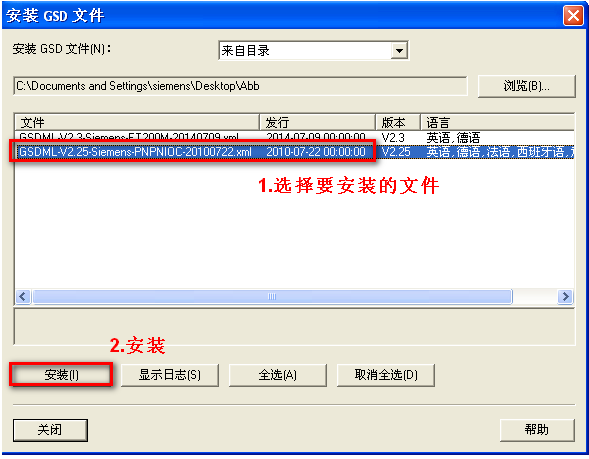

 安装完成后，按照所选用的的DP或PN总线，在硬件组态右侧---Profibus DP或Profinet IO---Additional Filed Devices查找。

#### 在TIA V1X中安装GSD

在TIA软件下，导入GSD文件是使用“选项”菜单下的“管理通用站描述文件（GSD）”命令

在打开的“管理通用站描述文件”窗口内，先选择对应GSDML文件的保存路径，然后在找到的GSDML文件中选择要添加的文件，选择“安装”按钮。

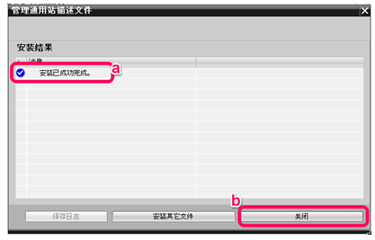

然后在“硬件目录”中“其它现场设备”下可以找到刚才添加的IO设备,并可看到其对应的GSDML文件的版本信息

##### 什么是GSD文件，GSD文件有什么实际作用？

GSD文件（Generic Station Description file）是通用站点描述文件的简称。顾名思义， 只有涉及到PROFIBUS DP 或者PROFINET IO 通讯才使用GSD文件。与step7硬件支持包不是一回事。

|             | 组态PROFIBUS DP主站 | 组态PROFIBUS DP从站 | 组态PROFINET IO 控制器 | 组态PROFINET IO 设备 |
| ----------- | ------------------- | ------------------- | ---------------------- | -------------------- |
| 是否需要GSD | 不需要              | 需要                | 不需要                 | 需要                 |

GSD 文件可以是多语言的，以便支持不同的语言。通过语言识别字母来替代“GSD”文件名扩展的末尾字母。

文件扩展名为GSD的表示文件是标准文件，扩展名为GSG表示文件是德语，GSE表示是英语，GSF表示是法语，GSI表示是意大利语，GSS表示是西班牙语，GSDML表示是用XML格式写的PROFINET设备描述文件。

##### GSD文件由谁来提供？

由设备生产厂家来提供。比如说有个第三方的变频器要挂在西门子300PLC PROFIBUS 总线上做从站，需要第三方提供变频器的GSD文件。

#### 西门子SIMATIC-CPU/CP的Profibus GSD文件（作从站用）

[PROFIBUS GSD文件：SIMATIC](https://support.industry.siemens.com/cs/cn/zh/view/113652)

#### 西门子ET200的Profibus GSD文件

[PROFIBUS GSD文件：ET 200M](https://support.industry.siemens.com/cs/cn/zh/view/113498)

***********************************************
### 通信距离（串口；Profibus；MPI；以太网）

在SIEMENSI工业通讯中，最常用的是串口；Profibus；MPI；以太网通讯，在下表中分别对其最大通讯距离进行描述。

#### 串口通信

| **类型**  | **速率**      | **最大距离** |
| --------- | ------------- | ------------ |
| RS 232C   | 300~115200bps | 15 m         |
| 20 mA TTY | 9600 bps      | 1000 m       |
|           | 19,200 bps    | 500 m        |
| 422/485   | 115.2 kbps    | 250 m        |
|           | 38.4 kbps     | 500 m        |
|           | 19.2 kbps     | 1200 m       |

注：表格中最大距离数据为通信双方的接口均为隔离型。

如其中任意一方的接口为非隔离型，则最大通信距离为50M。可通过增加第三方的485中继器扩展距离（西门子无用于串口的中继器设备）。

#### Profibus通信

标准Profibus电缆：

| **传输距离**      | **总线网段电缆的最大长度** | **两个站之间的最大距离** |
| ----------------- | -------------------------- | ------------------------ |
| 9.6 到 187.5 kbps | 1000 m                     | 10000 m                  |
| 500 kbps          | 400 m                      | 4000 m                   |
| 1.5 Mbps          | 200 m                      | 2000 m                   |
| 3 到 12 Mbps      | 100 m                      | 1000 m                   |

注： PROFIBUS总线最大可以通过9个中继器级联，所以两个站点的最大距离按10个总线段计算。

推荐选用西门子专用Profibus电缆，第三方无法保证连接的稳定性及通信距离。

Profibus电缆及接头，中继器的订货号请参看文档：[**常用附件订货号**](http://www.ad.siemens.com.cn/productportal/prods/published/Inf/Inf_1.5/Inf_1.5.html)

Profibus光纤：

| **光缆类型**     | **两个站之间的最大距离**                                     |
| ---------------- | ------------------------------------------------------------ |
| 标准塑料光纤电缆 | 连接 OLM/P 时的最大距离可达到 80 m，而连接集成有光学接口的设备和 OBT 时可达到 50 m。 |
| PCF光纤电缆      | 长度可达 400 m (OLM) 或 300 m （集成有光学接口的设备，OBT）  |
| 多模玻璃光缆     | 3 km                                                         |
| 单模玻璃光缆     | 15 km                                                        |

#### MPI通信

| **传输速率**  | **S7-300 CPU****（非隔离 MPI** **接口）** | **CPU 314C-2 PN/DP****、CPU** **315-PN/DP****、CPU 317****、CPU 319** |
| ------------- | ----------------------------------------- | ------------------------------------------------------------ |
| 19.2 kbit/s   | 50 m                                      | 1000 m                                                       |
| 187.5 kbit/s  |                                           |                                                              |
| 1.5 Mbit/s    | ----                                      | 200 m                                                        |
| 3.0~12 Mbit/s | ----                                      | 100 m                                                        |

#### 以太网通信

| **线缆类型**          | **两个站之间的最大距离** |
| --------------------- | ------------------------ |
| 西门子标准网线及接头  | 100m                     |
| 标准塑料光纤电缆(POF) | 50 m                     |
| PCF光纤电缆           | 100 m                    |
| 多模玻璃光纤          | 2km                      |
| 单模玻璃光纤          | 26km                     |

注：

\1. 推荐选用西门子标准网线接头，订货号请参看文档：[**常用附件订货号**](http://www.ad.siemens.com.cn/productportal/prods/published/Inf/Inf_1.5/Inf_1.5.html)

2.允许使用第三方网线接头，但由于网线屏蔽性能及质量，无法确保最大通信距离

3.可使用工业级交换机扩展通信距离。每增加一台交换机设备，可扩展表格中的“**两个站之间的最大距离**”；理论上通信距离可无限扩展。

\4. 工业以太网或PROFINET网络在使用玻璃光纤时， 两个站点间最大通讯距离与所使用的设备不同有可能不同，如多模玻璃光纤可能达到3Km的通讯距离，单模玻璃光纤可能达到120Km的通讯距离。

***********************************************
### 站名称,设备名称以及Profinet设备名称(STEP7 TIA)

一般来说，一个项目会有一个或几个站点，每个站点由CPU或接口模块与IO模块等组成。图1所示项目Project1有3个本地站点和2个分布式IO站点，每个站点都有站点名称，比如S7300/ET200M station_1，站点里的每个设备都有自己的名称，比如S7300/ET200M station_1站点里的CPU315-2PN/DP的名称为PLC1，CP343-1的名称为CP 343-1_1， 如图2所示。

图1

图2

#### 站名称

如果需要修改站名称，可以在站的属性里改，如图3所示。也可以在网络视图的网络概览里改，如图2所示。

图3

#### 设备名称

项目树里显示的是CPU 的名称，而不是站点名称，如图4所示。同一个项目下的站点名称或CPU名称都不能重复，如果需要修改CPU名称，可以直接在项目树里改，也可以在CPU 属性里改，如图5所示，还可以在网络视图的网络概览里改，如图2所示。

图4

#### Profinet设备名称

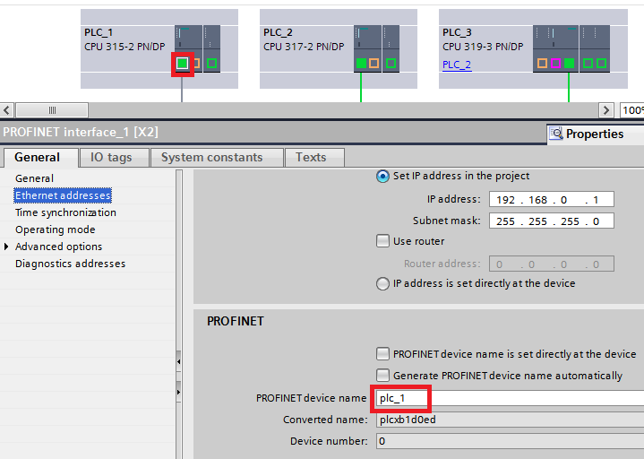

图6

***********************************************
### S7-300/400CPU和CP支持哪些连接/协议

根据所使用的 S7-300/400 CPU 或者 CP 将控制器连接到各种子网上。子网可以选择的连接/协议类型如下表。 

| **子网类型**          | **连接类型/协议**                                            |
| --------------------- | ------------------------------------------------------------ |
| MPI (多点协议接口)    | S7 通信 (S7-300 只做服务器)  GD 通信 (全局数据包通信) S7 基本通信 |
| PROFIBUS              | **DP** 分布式 I/O （通过集成 DP 口，CP342-5 和 CP443-5 扩展型） **FMS** - 现场总线报文规范 （通过 CP343-5 和 CP443-5 基本型） **FDL** - 现场总线数据链路层 （只能通过 PROFIBUS CP） **S7 通信** （S7-300 只做服务器1)） |
| 工业以太网 / PROFINET | **S7 通信** （通过以太网 CP 或集成的 PN 接口） **ISO 传输**（通过以太网 CP） **ISO-on-TCP** （通过以太网 CP 或集成的 PN 接口） **TCP** （通过以太网 CP 或集成的 PN 接口） **UDP** （通过以太网 CP 或集成的 PN 接口） **E-mail** （通过以太网 CP） **FTP** （通过以太网 CP） **PROFINET IO** （通过以太网 CP 或集成的 PN 接口） **CBA** （通过以太网 CP 或集成的 PN 接口) **MODBUS TCP** |
| PTP (点对点)          | RK 512 3964(R) ASCII 各种打印机的驱动 Modbus (RTU) (主/从) 2) Data highway DF1 2) ... |

1) S7 300：客户机功能只能通过 V5.2 版本以上的 CP342-5 实现。
2) 这些连接/协议的类型不能在 STEP 7 中作为标准组态，必须另外安装。

以太网或 PROFIBUS CP 的手册中有它们所支持通讯服务的说明。
此外，下面的访问条目号包含了 S7-300/400 以太网 CP 和 S7-300/400 集成 PN 接口 CPU 支持的通讯服务的概况。 

| **模块**                     | **访问条目号**                                               |
| ---------------------------- | ------------------------------------------------------------ |
| S7-400 以太网 CPs            | [15368142](https://support.industry.siemens.com/cs/document/15368142/simatic-s7-400-系列工业以太网-cp-支持哪些通讯服务?lc=zh-cn) |
| S7-300 以太网 CPs            | [16767769](https://support.industry.siemens.com/cs/document/16767769/simatic-s7-300-系列工业以太网-cp-模块之间有哪些区别？?lc=zh-cn) |
| S7-300/400 CPUs 集成 PN 接口 | [18909487](https://support.industry.siemens.com/cs/document/18909487/cpu集成的profinet接口、s7-软件控制器以及基于以太网的winac-rtx，支持哪?lc=zh-cn) |

S7 300/400 CPUs 手册中“技术数据”章节描述了控制器上集成的通信口支持的通讯服务：

| **模块**                    | **访问条目号**                                               |
| --------------------------- | ------------------------------------------------------------ |
| CPU S7 300                  | [12996906](https://support.industry.siemens.com/cs/document/12996906/simatic-s7-300-cpu-31xc-和-cpu-31x：技术规范?lc=zh-cn) |
| CPU S7 400 (没有集成 PN 口) | [14016796](https://support.industry.siemens.com/cs/document/14016796/s7-400自动化系统，cpu规格-系统手册-?lc=zh-cn) |
| CPU S7 400 (有集成 PN 口)   | [23904550](https://support.industry.siemens.com/cs/document/23904550/simatic-s7-400-s7-400自动化系统，cpu规格?lc=zh-cn) |

##### S7 通信的说明：

S7-300 支持 S7 通信，需要调用功能块 FB14/15 “GET/PUT”，FB12/13 “BSEND/BRCV” 或者 FB8/9 “USEND/URCV” 。通过：

- 集成 PN 口，功能块在 Standard Library -> Communication Blocks。
- CP卡，功能块在 SIMATIC_NET_CP 库。

对于 S7-400，通过功能块 SFB14/15 “GET/PUT”，SFB12/13 “BSEND/BRCV”或者 SFB8/9 “USEND/URCV”实现数据交换。 这些功能块的路径是 Standard Library -> System Function Block。

##### **通过** **CPU 上集成** **PN 接口通信的说明：

通过开放的 IE 通讯，使用 TCP，ISO-on-TCP 以及 UDP 协议实现数据交换。通过下面这些通讯块组态连接和数据交换：

- UDT 65 “TCON_PAR” 数据结构，包括为连接分配的参数
- UDT 66 “TCON_ADR”数据结构，包括通讯对象的参数地址 (UDP)
- FB 65 “TCON” 用于建立连接
- FB 66 “TDISCON” 用于释放连接
- FB 63 “TSEND” 通过 TCP 和 ISO-on-TCP 发送数据
- FB 64 “TRCV” 通过 TCP 和 ISO-on-TCP 接收数据
- FB 67 “TUSEND” 通过 UDP 发送数据
- FB 68 “TURCV” 通过 UDP 接收数据

***********************************************
### 西门子工业网络样本.

西门子工业网络样本为客户提供了工业网络中所使用的西门子产品完善的选型信息。其涉及产品包含控制器（CPU），CP通讯模块，交换机，各类型通讯线缆等。

#### 西门子工业网络样本目录

- 简介
- PROFINET/工业以太网
- PROFIBUS
- AS-Interface
- IO-Link
- 工业无线通信
- 工业远程通信
- 工业安全

#### 西门子工业网络样本下载地址及注意事项

西门子工业网络样本下载地址：[西门子工业网络样本](https://w3app.siemens.com/sc-static/catalogs/catalog/IK_PI_2015_en.pdf)

注意事项：此样本大小近100MB，请在合适的网络环境中下载。

***********************************************
## 工业以太网通信

### 基于工业以太网的S7通讯

#### [S7-300与S7-200之间的 S7通信（STEP7）](http://www.ad.siemens.com.cn/productportal/prods/published/Comm/Comm_5.1/Comm_5.1.html)

#### [S7-300与S7-200Smart之间的 S7通信（STEP7）](http://www.ad.siemens.com.cn/productportal/prods/published/Comm/Comm_5.2/Comm_5.2.html)

#### S7-300集成PN与300/400/1200/1500的S7通信（STEP7）

S7 协议是 SIEMENS S7系列产品之间通讯使用的标准协议，其优点是通信双方无论是在同一 MPI 总线上、同一 PROFIBUS 总线上或同一工业以太网中，都可通过 S7 协议建立通信连接，使用相同的编程方式进行数据交换而与使用何种总线或网络无关。S7 通信按组态方式可分为单边通信和双边通信，单边通信通常应用于以下情况：

- 通信伙伴无法组态 S7 连接
- 通信伙伴不允许停机
- 不希望在通讯伙伴侧增加通信组态和程序

本文档简要介绍在STEP7 V5.5环境下，S7-300 集成PN口的CPU基于工业以太网的S7单边通信的组态步骤，用于实现与S7-300/400/1200/1500 CPU之间的S7 通信。

##### 1、硬件与软件条件

| 设备            | 数量 | 订货号             | 注释 |
| --------------- | ---- | ------------------ | ---- |
| CPU 315-2 PN/DP | 2    | 6ES7317-2EH14-0AB0 | V3.2 |

表 1主要硬件列表

| 设备                     | 数量 | 订货号             | 注释 |
| ------------------------ | ---- | ------------------ | ---- |
| STEP 7 Professional V5.5 | 1    | 6ES7511-1AK00-0AB0 | V1.8 |
| CPU 1212C                | 1    | 6ES7212-1AE40-0XB0 | V4.2 |

表 2软件环境

##### 2、组态配置

###### 2.1 通过如下的步骤配置编程电脑的IP地址:

选择电脑的“ 控制面板 > 网络和共享 > 本地连接>属性”打开 Internet Protocol Version 4(TCP/IPv4)，设置PC的 IP 地址,本例中为192.168.0.131。
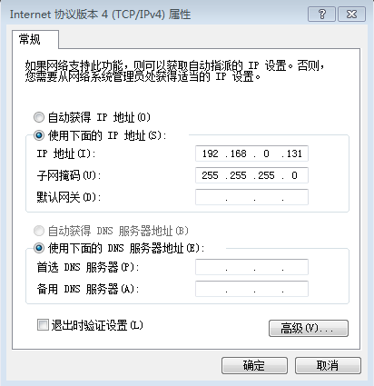

图1.设置PC地址

###### 2.2 在STEP7 中组态315-2PN/DP CPU，双击X2卡槽,再点击属性按钮以设置IP地址。(具体步骤请参见文档:[CPU硬件组态入门](http://www.ad.siemens.com.cn/productportal/prods/published/CPU/CPU_7.1/CPU_7.1.html))

图2.S7-300硬件组态

图3.PN-IO属性

###### 2.3 设置好IP地址后（本例中为192.168.0.1），点击New按钮添加一条子网Ethernet（1），如果已经存在子网，也可选中该子网直接点OK按钮即可。

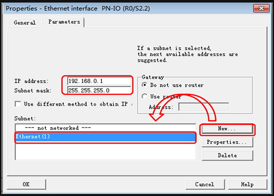

图4.添加IP地址和子网

###### 2.4 点击快捷菜单中的Configure Network按钮进入Netpro视图。

图5.点击Configure Network按钮

######  2.5 在Netpro视图的CPU上点右键选择Insert New Connection添加新连接。

图6.添加新连接
###### 2.6 通讯伙伴选择非指定（Unspecified），通讯类型选择S7 connection。

图7.选择通信伙伴和通信类型

###### 2.7 点击OK后在弹出的属性窗口中勾选单端组态（Establish an active connection），并填写通信伙伴的IP地址，注意Local ID编号，本例保持默认值1。点击详细按钮。

图8. S7连接属性

###### 2.8 在地址详细信息对话框中填写通信伙伴CPU的机架号和槽号，如通信伙伴是S7-300/400 CPU则槽号为2，如通信伙伴是S7-1200/1500 CPU则槽号为1。点击OK。

图9. S7地址详细

###### 2.9 选中CPU，先编译再下载

图10.编译下载

注：如不熟悉下载方法，可参考如下链接：

[https://www.ad.siemens.com.cn/productportal/Prods/published\Soft\Soft_3.5\Soft_3.5.html](https://www.ad.siemens.com.cn/productportal/Prods/published/Soft/Soft_3.5/Soft_3.5.html)

 

###### 2.10 下载完成后，可点击“激活连接状态”按钮，查看连接状态，如下图所示，则表示组态的连接已经成功建立。

图11.连接已建立

###### 2.11 如果出现如下图所示的情况，则说明连接没有建立，请检查网线的连接、IP地址等。

图12.连接未建立

##### 3、编写PLC程序，调用通讯块

###### 3.1 组态连接建立成功后，需要调用通讯功能块PUT和GET进行数据交换。S7-300用于通讯连接的功能块位于标准库中，如下图所示：

图13.PUT GET指令位置

 

###### 3.2调用PUT指令，本例中本地S7-300 CPU将DB10.DBB0开始的10个字节写入通信伙伴CPU 的DB11.DBB0开始的10个字节中。

图14.PUT指令

| 参数   | 说明                               |
| ------ | ---------------------------------- |
| REQ    | 上升沿触发，一次上升沿发送一次数据 |
| ID     | 连接ID（参看图8）                  |
| ADDR_1 | 指向伙伴CPU接收地址区域            |
| SD_1   | 指向本地CPU发送地址区域            |
| DONE   | 发送完成（上升沿）                 |
| ERROR  | 有故障发生（上升沿）               |
| STATUS | 故障代码                           |

表 3 PUT管脚说明

###### 3.3调用GET指令，本例中将通信伙伴CPU的DB20.DBB0开始的10个字节读入到本地S7-300 CPU的DB21.DBB0开始的10个字节中。

图15.GET指令

| 参数   | 说明                               |
| ------ | ---------------------------------- |
| REQ    | 上升沿触发，一次上升沿读取一次数据 |
| ID     | 连接ID（参看图8                    |
| ADDR_1 | 指向伙伴CPU发送地址区域            |
| RD_1   | 指向本地CPU接收地址区域            |
| DONE   | 接收完成（上升沿）                 |
| ERROR  | 有故障发生（上升沿）               |
| STATUS | 故障代码                           |

表 4 GET管脚说明

###### 3.4 S7-300 CPU做S7通讯的客户端时，伙伴CPU无需组态编程，准备好相应的数据区即可，如本例中的DB10和DB20。如果伙伴方是S7-1200（固件版本V4.0以上）或是S7-1500 CPU，需要在CPU属性的连接机制中勾选"允许来自远程对象的PUT/GET通信访问"，如下图所示：

图16.连接机制

#### S7-300集成PN与300/400/1200/1500的S7通信（TIA）

S7单边通信，仅需在客户端侧进行组态编程；服务器侧CPU无需组态编程。

所以在编程组态和建立连接方面，S7-300PN口做客户端，只需要在 S7-300CPU 侧建立单边连接，使用单边编程方式 PUT，GET 指令进行通信。

**所完成的通信任务：**

 S7-300 集成PN口CPU 作为客户端读取 对方S7 CPU中 DB1 的数据到 S7-300 的 DB3 中。
 S7-300 集成PN口CPU 作为客户端将本地 DB4 中的数据写到 对方 S7 CPU中 DB2 中。

**项目创建环境：**TIA V13 SP1

##### S7-300集成PN口侧组态编程

**新建项目并完成硬件配置**(具体步骤请参见文档:[CPU硬件组态入门](http://www.ad.siemens.com.cn/productportal/prods/published/CPU/CPU_7.1/CPU_7.1.html))

图1. 组态设置子网

**网络组态**

打开 “Network View（网络视图）” 配置网络，首先点中左上角的“Connections（网络）”图标，选择“S7 Connection（S7连接）”，然后选中300 CPU，右键选择“Add new connection（添加新连接）”如图所示。

图2. 添加连接

然后在“Create new connection（连接）”窗口中，选择“Unspecified”，然后点击“Add”建立 S7 连接，如图2.所示。

图3.建立 S7 连接

“S7_Connection_1（S7_连接_1）”为建立的连接，选中连接，在属性的“General(常规)”条目中填写对方设备的IP地址，如下图4.所示。

图4. 定义连接对方的 IP 地址

图5. 定义通讯双方的 TSAP 号

注意：

通信的对方设备为

- S7-300集成PN口或CP卡 ，TSAP地址：03.02
- S7-400集成PN口或CP卡 ，TSAP地址：03.XX； XX为400CPU设计插槽号
- S7-1200集成PN口 ，TSAP地址：03.00，或03.01
- S7-1500集成PN口或CP卡，TSAP地址：03.01

图6. 连接 ID 号

注意：此处的ID号，将在编程的PUt，GET块中填写（16进制）

配置完网络连接，编译保存并下载。

图7. 通讯连接状态

** 指令块编程**

在 OB1 中，从“Instruction（指令）” >“Communication（通信）” >“S7 Communication（S7通信）”下，调用Get、Put通信指令，创建接收和发送数据块 DB3 和 DB4，定义成 101 个字节的数组，程序调用如下图8.所示。

图8. 程序调用功能

功能块管脚说明：

| CALL “GET” | DB1                  | //调用 GET，使用背景DB块：DB1；                              |
| ---------- | -------------------- | ------------------------------------------------------------ |
| REQ        | M10.0+P沿            | //上升沿触发或使用系统时钟 ；                                |
| ID         | W#16#0001            | //连接号，要与连接配置中一致，创建连接时的连接号，如图5.所示； |
| NDR        | M30.0                | //为1时，接收到新数据；                                      |
| ERROR      | M30.1                | //为1时，有故障发生；                                        |
| STATUS     | MW32                 | //状态代码；                                                 |
| ADDR_1     | P#DB1.DBX0.0 BYTE 10 | //从通信伙伴数据区读取数据的地址；                           |
| RD_1       | P#DB3.DBX0.0 BYTE 10 | //本地接收数据地址；                                         |

| CALL “PUT” | DB2                  | //调用 PUT，使用背景DB块：DB2；                              |
| ---------- | -------------------- | ------------------------------------------------------------ |
| REQ        | M10.0+P沿            | //上升沿触发或使用系统时钟 ；                                |
| ID         | W#16#0001            | //连接号，要与连接配置中一致，创建连接时的连接号，如图5.所示； |
| DONE       | M30.2                | // 为1时，发送完成；                                         |
| ERROR      | M30.3                | // 为1时，有故障发生；                                       |
| STATUS     | MW34                 | // 状态代码；                                                |
| ADDR_1     | P#DB2.DBX0.0 BYTE 10 | // 发送到通信伙伴数据区的地址；                              |
| SD_1       | P#DB4.DBX0.0 BYTE 10 | // 本地发送数据区。                                          |

**监控结果**

通过在 S7-300 侧编程进行 S7 通讯，实现两个 CPU 之间数据交换，以S7-1200为例，结果如下图。

##### 服务器侧：S7-1200/1500CPU注意事项

当通信的对方CPU为S7-1200或S7-1500时，有如下步骤必须设置。

1. S7-1200，S7-1500用于通信存放数据的DB块，必须设置为“非优化”（即默认的勾选取消掉）如图10所示:

图10. S7-1x00的数据块非优化设置

\2. S7-1200CPU固件V4.0以上和S7-1500CPU，在CPU属性--->保护--->连接机制中，

勾选“允许从远程伙伴...”，如图11所示，

#### S7-300CP卡的S7通信（STEP7）

##### S7-300与S7-300PLC之间的以太网S7协议单边通讯

###### **第一步：组态PLC1的硬件**

###### **第二步：组态PLC2的硬件**

同第一步放方法一样，进行PLC2的硬件组态

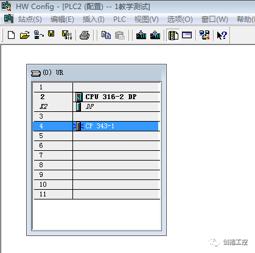

###### **第三步：建立S7通讯连接**

###### **第四步：进行通讯程序的编程**

**第一步中建立的通讯连接是在PLC1里建立的，下面我们的单边通讯需要在PLC1里面进行通讯程序编程**（如果在PLC2里建立的通讯连接，就需要在PLC2里进行通讯的相关编程）

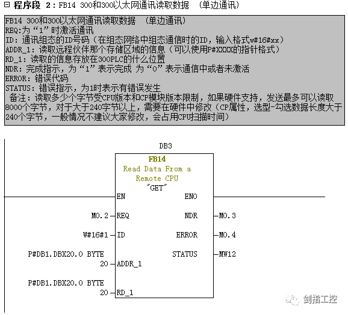

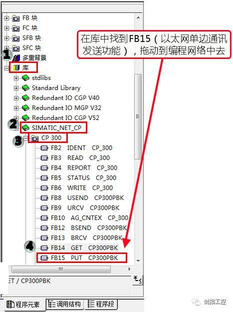

#### S7-300CP卡的S7通信（TIA）

##### 1 SIMATIC 的 S7 通信简介

S7 通讯（S7-communication）主要用于西门子 PLC 之间的通讯，是 S7 系列
PLC 基于 MPI、PROFIBUS 和工业以太网的一种优化的通讯协议。
S7 通信的特点：

- S7 通讯服务集成在所有 SIMATIC S7 控制器中。
- 属于 ISO 参考模型第 7 层（应用层）的服务。
- 采用客户端-服务器原则（Client-Server）。
- 适用于所有的 SIMATIC 子网（MPI，PROFIBUS 和工业以太网)。
- 在系统组态期间为 S7 通讯建立 S7 连接，S7 连接属于静态连接。
- 可以与同一个通讯伙伴建立多个连接，同一时刻可以访问的通讯伙伴的数量
- 取决于 CPU 以及 CP 的连接资源。

##### 2 本例设备简介

本文适用于 S7-1500 CPU 与带有 CP343-1 接口模块的 S7-300 站点之间实现
S7 单边通信。下面分别对 S7-1500 和带有 CP343-1 接口模块的 S7-300 站点作
为客户端或服务器的配置方式进行举例，使用 S7 单边通信。
下文对可能的四种方式进行讲解：
1、在同一个项目中组态，S7-1500 作为客户端，CP343-1 作为服务器。
2、在同一个项目中组态，CP343-1 作为客户端，S7-1500 作为服务器。
3、在不同项目中组态，S7-1500 作为客户端，CP343-1 作为服务器。
4、在不同项目中组态，CP343-1 作为客户端，S7-1500 作为服务器。
测试例程中用到的软硬件如表 2-1 所示：

|名称|数量|订货号|
| ---- | ---- | ---- |
|SIMATIC CPU314-2PtP(FW V2.6)|1|6ES7 314-6BG03-0AB0|
|SIMATIC NET CP343-1(FW V3.0)|1|6GK7 343-1EX30-0XE0|
|SIMATIC CPU1511C-1PN(FW V2.5)|1|6ES7 511-1CK00-0AB0|
|SIMATIC STEP7 Professional V15|1|6ES7 822-1AA05-0YA5|

表 2-1 例程中用到的软硬件列表

##### 3 在同一个项目中组态，S7-1500 作为客户端

下面以 S7-1500 CPU 与带有 CP343-1 接口模块的 S7-300 站点之间实现 S7 单边通信为例，详细介绍如何在同一个 TIA 项目中组态 S7-1500 作为客户端，
CP343-1 作为服务器。

###### 3.1 组态硬件

在 TIA V15 中创建一个新项目，添加 CPU1511C，在“设备视图”中，选择CPU 的以太网口，设置 IP 地址。如图 3-1 所示：

图 3-1 设置 CPU1511C 的 IP 地址
然后，再添加 CPU314C 和 CP343-1，打开“设备视图”，选择 CP343-1 的以太网口，设置 IP 地址。如图 3-2 所示：

接着，在“网络视图”窗口，左侧选择“连接”按钮，使得 CPU 变为蓝色高亮，在 1511C 上点击鼠标“右键”并选择“添加新连接”。如图 3-3 所示：

图 3-3 添加新连接

最后，在“创建新连接”窗口中，选择“PLC_2”，并在窗口右侧中选择“PLC_1，PROFINET 接口”，点击“添加”创建 S7 连接。如图 3-4 所示：

“S7_连接_1”为建立的连接，选中该连接，在属性的“常规”中可以查看该S7 连接的相关信息。如图 3-5 所示：

图 3-5 S7 连接信息

###### 3.2 S7-1500 中编程

在 S7-1500 的 OB1 主程序中，从“通信——>S7 通信”中调用 GET/PUT 指令。如图 3-6 所示：

本例中，使用 GET 指令将 S7-300 的 MB100~104 读取到 S7-1500 的 MB10~14；使用 PUT 指令将 S7-1500 的 MB20~24 写到 S7-300 的 MB200~204。
关于“GET”和“PUT”指令的更多信息，可以选中指令块按 F1 键，打开在线帮

###### 3.3 通信测试

完成上述操作后，将项目分别下载到 CPU 中。
在线后，可以通过“网络视图”查看 S7 连接的状态。如图 3-7 所示。

图 3-7 通信连接状态
最后，在线打开两套 PLC 的监控表，测试互相传输数据。如图 3-8 所示：

图 3-8 通信测试

##### 4  在同一个项目中组态，CP343-1 作为客户端

下面以 S7-1500 CPU 与带有 CP343-1 接口模块的 S7-300 站点之间实现 S7 单边通信为例，详细介绍如何在同一个 TIA 项目中组态 CP343-1 作为客户端，S7-1500 作为服务器。

###### 4.1 组态硬件

在 TIA V15 中创建一个新项目，添加 CPU314C 和 CP343-1，在“设备视图”中，选择 CP343-1 以太网口，设置 IP 地址。如图 4-1 所示：

图 4-1 设置 CP343-1 的 IP 地址
然后，再添加 CPU1511C，打开“设备视图”，选择 CPU 的以太网口，设置 IP地址。如图 4-2 所示：

图 4-2 设置 CPU1511C 的 IP 地址
默认设置中，S7-1500PLC 不允许来自远程的 PUT/GET 访问，需要在 CPU 属性的“连接机制”中使能该功能。如图 4-3 所示：

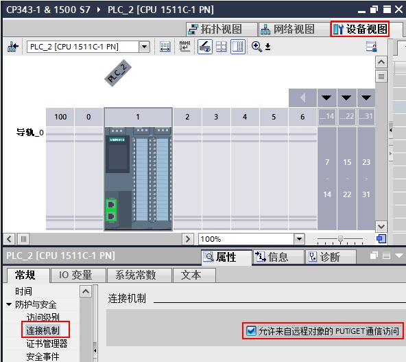

图 4-3 使能允许来自远程的 PUT/GET 访问

接着，在“网络视图”窗口，左侧选择“连接”按钮，使得 CPU 变为蓝色高亮，在 314C 上点击鼠标“右键”并选择“添加新连接”。如图 4-4 所示：

最后，在“创建新连接”窗口中，选择“PLC_2”，并在窗口右侧中选择“CP343-1_1，PROFINET 接口”，点击“添加”创建 S7 连接。如图 4-5 所示：

图 4-5 创建 S7 连接

“S7_连接_1”为建立的连接，选中该连接，在属性的“常规”中可以查看该S7 连接的相关信息。如图 4-6 所示：

图 4-6 S7 连接信息

###### 4.2 S7-300 中编程

在 S7-300 的 OB1 主程序中，从“通信——>S7 通信——>其它”中调用GET_S/PUT_S 指令。如图 4-7 所示：

本例中，使用 GET_S 指令将 S7-1500 的 MB100~104 读取到 S7-300 的 MB10~14；
使用 PUT_S 指令将 S7-300 的 MB20~24 写到 S7-1500 的 MB200~204。
关于“GET_S”和“PUT_S”指令的更多信息，可以选中指令块按 F1 键，打开在线帮助进行查看。

###### 4.3 通信测试

完成上述操作后，将项目分别下载到 CPU 中。
在线后，可以通过“网络视图”查看 S7 连接的状态。如图 4-8 所示。

图 4-8 通信连接状态

最后，在线打开两套 PLC 的监控表，测试互相传输数据。如图 4-9 所示：

图 4-9 通信测试

##### 5 在不同项目中组态，S7-1500 作为客户端

下面以 S7-1500 CPU 与带有 CP343-1 接口模块的 S7-300 站点之间实现 S7 单边通信为例，详细介绍如何在不同的项目中组态 S7-1500 作为客户端，CP343-1 作为服务器。

###### 5.1 PC1 组态 S7-1500 硬件

在 PC1 的 TIA V15 中创建一个新项目，添加 CPU1511C，在“设备视图”中，选择 CPU 的以太网口，设置 IP 地址。如图 5-1 所示：

图 5-1 设置 CPU1511C 的 IP 地址

然后，在“网络视图”窗口，左侧选择“连接”按钮，使得 CPU 变为蓝色高亮，在 1511C 上点击鼠标“右键”并选择“添加新连接”。如图 5-2 所示：

最后，在“创建新连接”窗口中，选择“未指定”，并在窗口右侧中选择“PLC_1，PROFINET 接口”，点击“添加”创建 S7 连接。如图 5-3 所示：

图 5-3 创建 S7 连接
“S7_连接_1”为建立的连接，选中该连接，在属性的“常规”中填写作为 S7通信服务器 CP343-1 的 IP 地址。如图 5-4 所示：

图 5-4 填写通信伙伴的 IP 地址
还需要在属性的“地址详细信息”中填写通信伙伴 300CPU 的 TSAP 信息（连
接资源号和 CPU 插槽号）。如图 5-5 所示：

图 5-5 填写通信伙伴的 TSAP

###### 5.2 PC2 组态 S7-300 硬件

在 PC2 的 TIA V15 中创建一个新项目，添加 CPU314C 和 CP343-1，在“设备视图”中，选择 CP343-1 的以太网口，设置 IP 地址。如图 5-6 所示：

图 5-6 设置 CP343-1 的 IP 地址

###### 5.3 S7-1500 中编程

在 S7-1500 的 OB1 主程序中，从“通信——>S7 通信”中调用 GET/PUT 指令。如图 5-7 所示：

图 5-7 程序调用
本例中，使用 GET 指令将 S7-300 的 MB100~104 读取到 S7-1500 的 MB10~14；使用 PUT 指令将 S7-1500 的 MB20~24 写到 S7-300 的 MB200~204。
关于“GET”和“PUT”指令的更多信息，可以选中指令块按 F1 键，打开在线帮助进行查看。

###### 5.4 通信测试

完成上述操作后，将项目分别下载到 CPU 中。
在线后，可以通过 S7-1500 项目的“网络视图”查看 S7 连接的状态。如图 5-8所示：

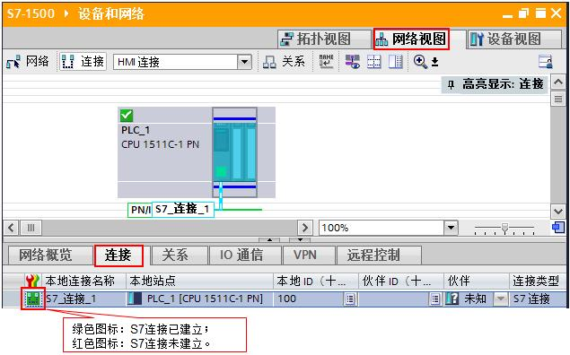

图 5-8 通信连接状态
最后，分别在两台 PC 中在线打开各自的 PLC 监控表，测试互相传输数据。如图 5-9 所示：

图 5-9 通信测试

##### 6 在不同项目中组态，CP343-1 作为客户端

下面以 S7-1500 CPU 与带有 CP343-1 接口模块的 S7-300 站点之间实现 S7 单边通信为例，详细介绍如何在不同的项目中组态 CP343-1 作为客户端，S7-1500 作为服务器。

###### 6.1 PC1 组态 S7-300 硬件

在 PC1 的 TIA V15 中创建一个新项目，添加 CPU314C 和 CP343-1，在“设备视图”中，选择 CP343-1 的以太网口，设置 IP 地址。如图 6-1 所示：

图 6-1 设置 CP343-1 的 IP 地址
然后，在“网络视图”窗口，左侧选择“连接”按钮，使得 CPU 变为蓝色高亮，在 314C 上点击鼠标“右键”并选择“添加新连接”。如图 6-2 所示：

图 6-2 添加新连接
最后，在“创建新连接”窗口中，选择“未指定”，并在窗口右侧中选择“CP343-1_1，PROFINET 接口”，点击“添加”创建 S7 连接。如图 6-3 所示：

图 6-3 创建 S7 连接
“S7_连接_1”为建立的连接，选中该连接，在属性的“常规”中填写作为 S7通信服务器 1511C 的 IP 地址。如图 6-4 所示：

还需要在属性的“地址详细信息”中填写通信伙伴 1511C 的 TSAP 信息（连接资源号和 CPU 插槽号）。如图 6-5 所示：

图 6-5 填写通信伙伴的 TSAP

###### 6.2 PC2 组态 S7-1500 硬件

在 PC2 的 TIA V15 中创建一个新项目，添加 CPU1511C，在“设备视图”中，选择 CPU 的以太网口，设置 IP 地址。如图 6-6 所示：

图 6-6 设置 CPU1511C 的 IP 地址
默认设置中，S7-1500PLC 不允许来自远程的 PUT/GET 访问，需要在 CPU 属性的“连接机制”中使能该功能。如图 6-7 所示：

图 6-7 使能允许来自远程的 PUT/GET 访问

###### 6.3 S7-300 中编程

在 S7-300 的 OB1 主程序中，从“通信——>S7 通信——>其它”中调用GET_S/PUT_S 指令。如图 6-8 所示：

图 6-8 程序调用
本例中，使用 GET_S 指令将 S7-1500 的 MB100~104 读取到 S7-300 的 MB10~14；
使用 PUT_S 指令将 S7-300 的 MB20~24 写到 S7-1500 的 MB200~204。
关于“GET_S”和“PUT_S”指令的更多信息，可以选中指令块按 F1 键，打开在线帮助进行查看。

###### 6.4 通信测试

完成上述操作后，将项目分别下载到 CPU 中。
在线后，可以通过 S7-300 项目的“网络视图”查看 S7 连接的状态。如图 6-9所示

图 6-9 通信连接状态
最后，分别在两台 PC 中在线打开各自的 PLC 监控表，测试互相传输数据。如图 6-10 所示：

图 6-10 通信测试

#### S7容错连接

·     [S7容错连接简介](http://www.ad.siemens.com.cn/productportal/prods/published/PCS7_TOP_V2/S7_REDCONNECT/S7_REDCONNECT/S7_REDCONNECT.htm)

·     [S7容错连接授权](http://www.ad.siemens.com.cn/productportal/prods/published/PCS7_TOP_V2/S7_REDCONNECT/S7_REDCONNECT_LICENSE/S7_REDCONNECT_LICENSE.htm)

·     [创建](http://www.ad.siemens.com.cn/productportal/prods/published/PCS7_TOP_V2/S7_REDCONNECT/S7_REDCONNECT_Failure/S7_REDCONNECT_Failure.htm)[S7容错连接的常见错误](http://www.ad.siemens.com.cn/productportal/prods/published/PCS7_TOP_V2/S7_REDCONNECT/S7_REDCONNECT_Failure/S7_REDCONNECT_Failure.htm)

·     [为PC站选择网卡（CP1613/1623/普通网卡）](http://www.ad.siemens.com.cn/productportal/prods/published/PCS7_TOP_V2/PC_Station/Selection_Network_Adapter.htm)

·    [其它常见问题](http://www.ad.siemens.com.cn/productportal/prods/published/PCS7_TOP_V2/S7_REDCONNECT/S7_REDCONNECT_FAQ/S7_REDCONNECT_FAQ.htm)

Ø 问题1.什么时候需要使用S7容错连接通讯？

Ø 问题2.第三方上位如何和400H系统通讯？

Ø 问题3.能否使用CPU集成的PROFINET建立S7容错连接？

Ø 问题4.实现S7容错连接需要购买什么软件？

Ø 问题5.PC和400H的S7容错连接常见的网络结构？

Ø 问题6.上位机网卡（CP1613/1623）冗余4路径连接

Ø 问题7.SIMATICNETOPCServer建立S7容错连接无法切换？

Ø 问题8.CP1613、CP1613A2、CP1623等网卡在哪些操作系统下可以使用？

Ø 问题9.是否可以同时使用CP1623的两个RJ45端口冗余通讯？

Ø 问题10.普通网卡是否支持S7容错连接

----------------------------------------------------------------------------------------------------

### TCP通信

#### S7-300集成PN口的TCP通信（STEP7）

##### 1.   概述

###### 介绍

   SIMATIC S7- PN CPU包含一个集成的 PROFINET 接口，该接口除了具有 PROFINET I/O功能外还具有 TCP 通信功能。通过该集成以太网接口组态 TCP 通信时，只能使用开放式通信专用的功能块。依据RFC793的TCP协议，在STEP7”通讯块”的“标准库”（图1所示）中提供了下列FB，通过用户程序与符合以太网标准的通讯伙伴进行数据交换:

·     用于分配连接参数的UDT 65 "TCON_PAR"

·     用于建立连接的FB 65 "TCON"

·     用于终止连接的FB 66 "TDISCON"

·     用于发送数据的FB 63 "TSEND"

·     用于接收数据的FB 64 "TRCV"

OPEN Communication Wizard下载地址链接：https://support.automation.siemens.com/CN/view/zh/25209116

图1

######  解决方案

要通过 S7-PN CPU 的 集成PROFINET 接口实现开放的 TCP 通信，不能在硬件组态中完成，必须在一个数据块中指定每个连接的参数。使用“Open Communication Wizard”工具可以简单明了地指定连接参数，该工具可将一个包含所有参数的 UDT 导出到您的 STEP 项目中。使用该 UDT 可建立含有连接描述的数据块。随后，需使用通信功能块 FB65 "TCON"、FB66 "TDISCON"、FB63 "TSEND" 和 FB64 "TRCV"完成程序的编写。

##### 2.   系统配置

CPU采用两个315-2PN/DP，使用以太网进行通信，网络拓扑如图2所示：

图2

##### 3.   配置OPEN Communication Wizard

首先使用STEP7创建一个项目，名称为open_TCP_wizard，建立两个315PN/DP站。安装并打开向导。从路径“开始àSimaticàOpen Communication Wizardà Open Communication Wizard”打开向导。打开后如图3所示，点击下一步：

图3

​     在图4中选择STEP7项目以及块文件夹，点击下一步，如图5所示：

图4

图5

在图5中选择New, 然后点击下一步，如图6所示：

图6

   在图6中选择TCP native, 点击下一步，如图7所示：

图7

点击下一步，如图8所示：

图8

在图8中设置两个315PN/DP的“Connection ID”“Connection name ”“Connection establishment”“IP address”“Used interface”，在本例中，将partner A设置为Active，即为客户端。Partner B设置为Passive，即为服务器端。对于“Unspecified connection partner”，如果选中，则服务器端不指定客户端的IP地址；如果不选中，则服务器端指定客户端的IP地址。点击下一步，如图9所示：

图9

在图9中设定partnet B的端口号，本例中设置为2000。点击下一步，如图10所示：

图10

在图10中分别定义用于TCP通信的数据连接结构的名称UDT65, 以及在项目open_TCP_wizard中选择块文件夹。点击下一步如图11所示，再点击下一步如图12所示：

图11

图12

编译无误后如图13所示：

图13

点击Finish完成向导的配置。这样在项目open_TCP_wizard的块中生成了UDT65, 如图14所示。

图14

##### 4.   在STEP7中为项目open_TCP_wizard编写程序

  首先为Active端编写程序。在SIMATIC 315PN-1的块中创建DB101，定义一个变量DB_VAR，变量类型为UDT65。如图15所示

图15

在OB1中依次调用FB65，FB63，FB64，FB66，如图16，17，18，19所示：

图16

程序中的参数说明见表1

| 参数名  | 参数说明                    |
| ------- | --------------------------- |
| REQ     | 上升沿触发建立通信连接      |
| ID      | 连接ID                      |
| CONNECT | 与变量类型为UDT65的变量相连 |
| DONE    | 为1时，连接正确建立         |
| BUSY    | 为1时，正建立连接           |
| ERROR   | 为1时，有故障发生           |
| STATUS  | 故障代码                    |

表1 FB65参数说明

图17

程序中的参数说明见表2

| 参数名 | 参数说明            |
| ------ | ------------------- |
| REQ    | 上升沿触发          |
| ID     | 连接ID              |
| LEN    | 数据发送的最大长度  |
| DATA   | 数据发送的区域      |
| DONE   | 为1时，连接正确建立 |
| BUSY   | 为1时，正建立连接   |
| ERROR  | 为1时，有故障发生   |
| STATUS | 故障代码            |

表2 FB63参数说明

图18

程序中的参数说明见表3

| 参数名   | 参数说明           |
| -------- | ------------------ |
| EN_R     | 为1时使能          |
| ID       | 连接ID             |
| LEN      | 接收区域的长度     |
| DATA     | 接收数据区         |
| NDR      | 为1时，接收完成    |
| BUSY     | 为1时，正在接收    |
| ERROR    | 为1时，有故障发生  |
| STATUS   | 故障代码           |
| RCVD_LEN | 实际接收的数据长度 |

表3 FB64参数说明

图19

程序中的参数说明见表4

| 参数名 | 参数说明            |
| ------ | ------------------- |
| REQ    | 上升沿触发          |
| ID     | 连接ID              |
| DONE   | 为1时，断开连接完成 |
| BUSY   | 为1时，正断开连接   |
| ERROR  | 为1时，有故障发生   |
| STATUS | 故障代码            |

表4 FB66参数说明

OB1编写完成后，SIMATIC 315PN-1的程序块如图20所示：

图20

   同理，为SIMATIC 315PN-2站编写程序，与SIMATIC 315PN-1类似，在DB101中定义数据类型为UDT65的变量，在OB1中调用FB65，FB63，FB64，FB66。将硬件组态和程序分别下到两个S7300站中。

   在cpu运行的情况下分别监控两个站OB1的状态。首先在两个站的FB65中，将“REQ”置1，使连接建立。然后将SIMATIC 315PN-1 MB100-MB109赋值B#16#12，同时在SIMATIC 315PN-2站中将FB64的EN_R置1，接着在SIMATIC 315PN-1的FB63中，将M0.2设置上升沿信号，此时SIMATIC 315PN-2站的MB200-MB209接收到来自SIMATIC 315PN-1站的数据B#16#12，如图21所示：

图21

同样的操作，将SIMATIC 315PN-2的MB100-MB109赋值B#16#03，SIMATIC 315PN-1的MB200-MB209接收到B#16#03，图22所示。

图22

##### 5.   常见问题

 **接收区的长度怎么指定？**

如果LEN不为0，区域长度由LEN的值指定；如果LEN为0，则由DATA参数长度信息指定。

- **接收功能块** **FB64** **的参数** **LEN** **怎么设置？**

答：接收器无法检测数据流中的某条消息在何处结束以及下一条消息在何处开始。因此，建议将通讯伙伴接收功能块FB64 的参数LEN设置为发送方FB63 参数LEN的值，即通信双方发送区的长度与对方接收区的长度保持一致。

- **FB64** **有时显示故障代码** **80A1** **？**

​      答：通信双方的通信连接未成功建立，先执行FB66，然后再次调用FB65。

- **FB65** **的** **DONE** **为什么一直为** **0** **？**

​      答：在连接建立的很短时间 内DONE为1，然后复位到0，所以无法监控1的状态。可以通过采集它的上升沿信号来获取。

- **FB65** **显示故障代码** **873A?**

 答：功能块没有正确关联变量类型为UDT65的参数。检查所定义的变量以及相应的DB块。

#### S7-1500 (S) 与 S7-300 PN CPU (C) 之间的 TCP 通信(TIA)

##### 1.概述

SIMATIC S7- 1500 CPU集成了 PROFINET 接口，该接口除了具备连接 PROFINET总线通信功能，同时还可用于标准的 TCP 通信。通过组态TCP连接或使用开放式通信专用功能块与其它设备建立TCP连接以实现通信。本文介绍了S7-1500 CPU与S7-300 PN CPU进行TCP通信的配置过程。

##### 2.自动化解决方案

###### 2.1网络拓扑结构

如图1所示，1500 PLC（192.168.0.1/24）与 300 PN CPU（192.168.0.2/24）进行OPEN IE TCP通信。

图 1网络拓扑结构

### **2.2** 硬件与软件需求

| 设备                | 数量 | 订货号             | 注释           |
| ------------------- | ---- | ------------------ | -------------- |
| PM190 W 120/230 VAC | 1    | 6EP1333-4BA00      | 负载电源模块   |
| CPU 1511-1          | 1    | 6ES7511-1AK00-0AB0 | V1.7           |
| 存储卡2GB           | 1    | 6ES7954-8LP01-0AA0 | 作为装载存储器 |
| CPU 317-2 PN/DP     | 1    | 6ES7317-2EK14-0AB0 | V3.1           |
| SCALANCE X208       | 1    | 6GK5208-0BA10-2AA3 | 交换机         |

表 1硬件列表

| 设备                                          | 数量 | 订货号             | 注释 |
| --------------------------------------------- | ---- | ------------------ | ---- |
| STEP 7 Professional V13 SP1 Update1           | 1    | 6ES7822-1AA03-0YA5 |      |
| Windows 7 Ultimate SP164-bit Operating System | 1    |                    |      |

表 2软件环境

##### 3.组态配置

###### 3.1分配 IP地址

通过如下的步骤配置 PC的 IP地址

| **步骤** | **操作**                                                     | **备注**                                                     |
| -------- | ------------------------------------------------------------ | ------------------------------------------------------------ |
| 1.       | 选择 “开始 > 控制面板 > 网络和共享 > 本地连接>属性”打开 Internet Protocol Version 4(TCP/IPv4)，设置PC的 IP 地址。 |  |

 分配CPU模块的IP地址

| **步骤** | **操作**                                                     | **备注**                                                     |
| -------- | ------------------------------------------------------------ | ------------------------------------------------------------ |
| 1.       | 用网线将两个CPU和PG分别连接到X208交换机上                    | 将设备连接到同一个以太网物理网上                             |
| 2.       | 在 Engineer PC 上打开 TIA V13。进入项目视图，展开项目树下的“在线访问”，选择实际使用的物理网卡，双击“更新可访问的设备”。 |  |
| 3.       | 按照打印在CP1511-1模块上的X1接口MAC地址来确定需要分配IP地址的设备，本案例为00-1B-1B-13-92-E6，展开“可访问设备[00-1B-1B-13-92-E6]”,双击“在线和诊断”。 |  |
| 4..      | 在工作区选择“功能”下的“分配IP地址”，输入IP地址192.168.0.1和子网掩码255.255.255.0，点击“分配IP地址”,操作成功后可在巡视窗口信息页面看到 “参数已成功传送”消息。 |  |
| 5        | 类似操作为CPU317分配IP地址192.168.0.2和子网掩码255.255.255.0 |                                                              |

###### 3.2 创建 PLC 项目

在 STEP7 V13中创建一个项目并插入CPU1511-1 和CPU 317站。操作步骤如表3

| **步骤** | **操作**                                                     | **备注**                                                     |
| -------- | ------------------------------------------------------------ | ------------------------------------------------------------ |
| 1.       | 在 Engineer PC 上打开 TIA V13。在 “项目” 菜单中选择 “新建（N）…” 选项。 |  |
| 2.       | 在弹出的创建新项目窗口里输入项目名为“1500_TCP”， 然后点击“创建”按钮。 |  |
| 3..      | 在项目树 1500_TCP下点击“添加新设备”。                        |  |
| 4.       | 输入设备名称PLC_1并组态控制器，SIMATIC S7-1500下的CPU1511-1 PN, 选择实际使用CPU的订货号以及版本号，本案例使用的是6ES7590-1AF30-0AA0 V1.7，点击“确认”后进入设备视图。 |  |
| 5.       | 在工作区的设备视图下双击CPU1511-1 接口可打开位于巡视窗口下的属性页，选择“常规”下方的“以太网地址”，为以太网接口添加子网PN/IE_1，设置IP地址192.168.0.1和子网掩码255.255.255.0 。 |  |
| 6        | 重复步骤3~5，插入317 PLC，分配IP地址及子网掩码               |  |

表3 硬件组态 

###### 3.3  TCP通信编程

| **步骤** | **操作**                                                     | **备注**                                                     |
| -------- | ------------------------------------------------------------ | ------------------------------------------------------------ |
| **1.**   | 在项目树下PLC_1程序块中添加新块，类型选择全局DB， 创建发送数据区DB1，并定义10个字节的数组为发送区。 （数据区大小根据实际应用定义） |  |
| **2.**   | 继续添加全局DB，创建接收数据区DB2， 并定义10个字节的数组为接收区。（数据区大小根据实际应用定义） |  |
| **3.**   | 打开OB1，将指令TRCV_C拖拽至OB1的程序段1， 根据提示操作添加背景数据块“TRCV_C_DB”。 |  |
| **4**    | 在巡视窗口下选择“属性”，“组态”下的“连接参数”： l 伙伴选择“PLC_2”；l 接口选择CPU实际使用的以太网接口；l 组态模式选择“使用程序块” |  |
| **5**    | l 本地和伙伴的连接数据下拉框均选择“<新建>”， 将分别创建各自的连接数据块“PLC_1_Receive_DB” 和“PLC_2_Send_DB”，并自动创建各自的连接ID， 此处均为1l 当创建完连接数据块后,连接类型即可选择, 本例中使用的连接类型为“TCP”。l 如果1500 CPU作为 TCP连接服务器端，则在伙伴侧选择“主动建立连接”； 如果1500 CPU作为客户端，则在本地侧选择“主动建立连接” ，本例程设计为1500CPU作为TCP服务器端； |  |
| **6**    | l 1500 本地端口设为2000，用于侦听来自客户端 317CPU的TCP连接请求；l 伙伴端口是317CPU客户端 向服务器端发起建立连接请求时使用的端口号， 此处不填表示客户端可使用任意端口； |  |
| **7**    | 选择“属性”页下“组态”中“块参数”： l EN_R设置为TRUE，保持接收； l CONT = 1， 保持连接；l 确认CONNECT指针指向"PLC_1_Receive_DB"l  将步骤1中预定义的接收DB数组作为起始地址； |  |
| **8**    | 将指令TSEND拖拽至OB1的程序段2中，根据提示操作添加 背景数据块“TSEND_DB”，填写TRCV参数： l 设置“Tag_1”（%M0.0）作为REQ触发信号， 上升沿有效；l ID参数为TSEND_C创建连接时系统 自动生成的连接ID号（见步骤5），此处为1； l LEN参数此处设置为接收10个字节。DATA参数使用 步骤2中预定义的发送DB数组“"发送数据区".SendBuff”。 |  |
| **9**    | 参照步骤1和2，在PLC_2下添加发送数据区DB2， 并定义10个字节的数组为发送区。（数据区大小 根据实际应用定义），添加接收数据区DB3，并 定义10个字节的数组为接收区。（数据区大小 根据实际应用定义） |  |
| **10**   | 打开OB1，将指令TCON拖拽至OB1的程序段1， 根据提示操作添加背景数据块“TCON_DB”。 |  |
| **11**   | 在巡视窗口下选择“属性”，“组态”下的“连接参数” ：l 伙伴选择“PLC_1”；l 接口选择CPU实际 使用的以太网接口；l 连接类型选择TCP； l 连接数据选择步骤5生成的连接DB，本地 为“PLC_2_Send_DB”，伙伴为“PLC_1_Receive_DB”； |  |
| **12**   | 设置“Tag_1”（%M0.0）作为REQ触发信号 ，上升沿有效；       |  |
| **13**   | 继续将TSEND和TRCV指令分别拖拽至程序段2 和程序段3，根据提示添加相应的背景数据块 TSEND参数：l REQ：Tag_2（M0.1）上升 沿有效l ID：参看步骤11的本地ID，此处为1； l LEN：10字节l DATA："发送数据区".SendBuff；  TRCV参数：l EN_R：设置为TRUE， 由M0.2简单逻辑实现；l ID：参看步骤11的本地ID， 此处为1；l LEN：10字节；l DATA："接收数据区".RecvBuff |  |

表5 T_BLOCK编程

###### 3.4  下载组态到站点

如图2所示，在项目树中选中PLC_1，点击工具栏中的下载图标，弹出下载对话框如图3所示。

图 2 下载站点配置

下载对话框设置

a.   PG/PC接口的类型下拉框中选择PN/IE

b.   PG/PC接口下拉框中选择连接CPU的实际以太网卡

c.   接口/子网的连接下拉框选择CPU连接的子网PN/IE_1

d.   点击“开始搜索”按钮，搜索网络连接的兼容设备

e.   在兼容设备列表中选择搜索出的设备CPU1511-1 PN

f.    点击“下载”按钮，按照提示完成站点下载

图 3下载对话框

   参看以上步骤下载PLC_2到CPU317中

##### 4.TCP通信测试

在PLC_1和PLC_2中各建立一个监视变量表并进入监视状态如图4所示，将PLC_1发送区数据设为全16#01，PLC_2发送区数据设为全16#02；

PLC_2下M0.0从0→1→0，点击项目树下设备和网络在工作列表区下查看连接是否建立，如图5所示表示连接已建立，在巡视窗口诊断页面连接信息中能查到更多关于连接的详细信息。

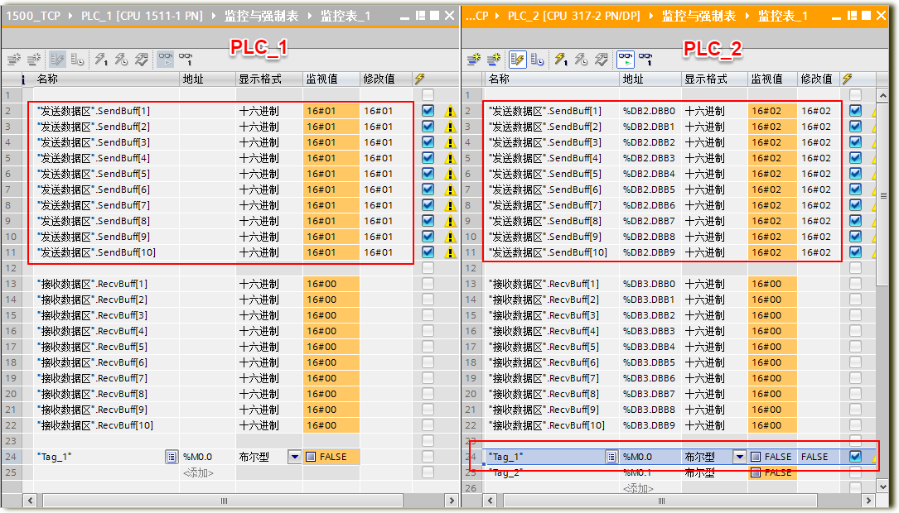

图4 创建监视变量表

图5 检测连接状态

   PLC_2下M0.1从0→1→0，PLC_2发送10字节到PLC_1，如图6所示PLC_1能正确接收PLC_2发送的数据；类似PLC_2下M0.0从0→1→0，PLC_1发送10字节到PLC_2，PLC_2也能正确接收PLC_1发送的数据。

图6 数据收发测试

#### S7-1500 (C) 与S7-300 PN CPU(S)(STEP7)之间的TCP通信

##### 1.开放式用户通信概述

通过开放式用户通信（Open User communication,OUC）， S7-1200/1500 和 S7-300/400 CPU 可以使用集成的 PN/IE 接口进行数据交换。开放式用户通信的主要特点是在所传送的数据结构方面具有高度的灵活性。 这就允许 CPU 与任何通信设备进行开放式数据交换，通信伙伴可以是两个 SIMATIC PLC，也可以是 SIMATIC PLC 和相应的第三方设备，前提是这些设备支持该集成接口可用的连接类型。由于此通信仅由用户程序中的指令进行控制，因此可以在程序中建立和终止事件驱动型连接。 在运行期间，也可以通过用户程序修改连接。

对于具有集成 PN/IE 接口的 CPU，可使用 TCP、UDP 和 ISO-on-TCP 连接类型进行开放式用户通信。

开放式用户通信的编程一般包括三个步骤：

● 建立连接
● 发送接收数据
● 断开连接

一般需要用到如下指令和UDT：

● 面向连接的协议： TCP，ISO on TCP：

​	o  UDT 65“TCON_PAR”，提供数据结构，可以指定连接参数

​	o  "TCON"，用于建立连接

​	o  "TDISCON"，用于终止连接

​	o  "TSEND"，用于发送数据

​	o  "TRCV"，用于接收数据

● 无连接协议： UDP

​	o  UDT 65“TCON_PAR”，提供数据结构，可以指定本地通信接入点的参数

​	o  UDT66“TADDR_PAR“，提供数据结构，指定通信伙伴接入点的参数

​	o  "TCON"，用于建立本地通信的接入点

​	o  "TDISCON"，用于取消本地通信接入点

​	o  "TUSEND"，用于发送数据

​	o  "TURCV"，用于接收数据

● 对于S7-1200/1500，还可以通过集成的精简指令即可实现建立和终止连接并传送数据，这样编程会更简单。

​	o  TSEND_C（连接建立/终止，发送）

​	o  TRCV_C（连接建立/终止，接收）

对于S7-1500与S7-300/400之间进行开放式用户通信，根据组态编程的方式不同，可以分为：

● 用TIA Portal STEP 7在同一项目下组态编程

● 用TIA Portal STEP 7在不同项目下组态编程

● 不同项目下分别用TIA Portal STEP 7 V1x组态编程S7-1500和用STEP 7 V5.x组态编程S7-300/400

本文以不同项目下分别用TIA Portal STEP 7 V1x组态S7-1500和以经典STEP 7V5.x组态S7-30/400为例介绍如何实现S7-1500与S7-300/400的TCP开放式用户通信。

其中所用设备及IP地址如图1-1所示。

图1 -1网络结构图

##### 2. S7-1500侧的组态编程

本例中在S7-1500侧采用集成的简单指令“TSEND_C”和“TRCV_C”来实现连接关系的建立中止以及数据的发送接收。

2.1 在TIA Portal STEP 7 V13中组态S7-1500CPU，为集成PN口分配IP地址192.168.0.10，子网掩码255.255.255.0，如图2-1所示。

图2 -1配置CPU以太网地址

2.2 在主循环程序中调用功能块“TSEND_C”编写集成发送程序，为其分配背景数据块。如图2-2所示。其接口参数可以通过组态进行配置，在2.3中介绍。该块在REQ上升沿时触发数据发送。

图2 -2调用“TCON_C”管理连接并发送数据

2.3 选中“TSEND_C”块，在属性组态菜单中，按如下顺序为“TSEND-C”块组态连接参数。在本例中，S7-1500与S7-300不在同一项目下，所以首先通信伙伴选择为未指定。然后新建连接数据，系统自动分配连接数据存储在PLC_1_Send_DB中。选择连接类型TCP，选择组态模式为使用程序块。指定通信伙伴的IP地址192.168.0.20，指定连接ID为1，选择一方主动要建立连接，本例中选择S7-1500主动建立连接。接下来定义本地的端口号和通信伙伴端口号。本例中都选择端口号2000。如图2-3所示。此处定义的端口号和IP地址必须与在S7-300侧一致。

图2 -3配置“TSEND_C”的连接参数

配置完成后，可以打开PLC_1_Send_DB查看，如图2-4所示，可以看到其中包含TCP连接所需的参数，并且该PLC_1_Send_DB作为变量已经自动填到“TSEND_C”相应的输入管脚CONNECT上。

图2 -4“TSEND_C”的连接参数

2.4 在属性组态菜单中，按照文字说明为“TSEND-C”块组态块参数，如图2-5所示。本例中，CPU以1Hz频率的系统时钟周期性发送数据，在REQ上升沿时激活。连接关系在CONT为1时建立并保持，为0时断开。发送的地址区为M100.0开始的100个字节。具体参数含义可以选中该块并按F1键，参考在线帮助。

图2 -5调用“TRCV_C”管理连接并接收数据

2.5 在主循环程序中调用功能块“TRCV_C”编写集成接收程序，为其分配背景数据块。如图2-6所示。“TRCV_C”接口参数的配置参考“TSEND_C”块的配置，此处从略。其中，连接参数可以新建，也可以直接选择刚才通过“TSEND_C”建立的连接数据块“PLC_1_Send_DB”。本例中，选择与发送同一个连接数据块。块参数中EN_R参数为1时接收以，CONT参数为1时建立保持连接，为0时断开连接。接收数据存储在M200.0开始的100个字节内。

图2 -6调用“TRCV_C”管理连接并接收数据

2.6 完成编程组态并下载后，可以在S7-1500中，通过点击“TSEND_C”或“TRCV_C”程序块右上角的诊断图标，进入连接在线信息页面可以查看连接状态，如图2-7所示。

图2 -7在S7-1500中查看连接状态信息

##### 3.S7-300侧的组态编程

3.1 在STEP7 V5.5中组态S7300CPU，为其PN口分配IP地址192.168.0.20，子网掩码255.255.255.0，如图3-1所示。

图3 -1配置S7-300CPU以太网地址

3.2 通过开放式通信向导，创建连接参数。开放式通信向导下载地址：https://support.automation.siemens.com/CN/view/zh/98957840，下载安装后打开向导，定位到所创建的S7-300项目，如图3-2所示。

图3 -2启动开放通信向导，定位项目文件夹

3.3 点击Next，新建连接参数UDT，如图3-3所示。

图3 -3新建连接

3.4 选择连接类型，此处选择TCP native，如图3-4所示。

图3 -4选择连接类型

3.5 点击Next至一步，因为**本例中****S7-300** **与通信伙伴** **S7-1500** **不在同一项目下而且通信伙伴** **S7-1500** **不是** **S7-300/400** **系列产品，所以勾选** **Only communication partner A shall be configured(** **仅配置伙伴** **A)** **和** **Communication partner B is not a S7-CPU(eg. A PC)(** **通信伙伴** **B** **不是** **S7-CPU)**，如图3-5所示。

图3 -5选择通信伙伴

3.6 点击Next至下一步，定义连接ID和连接名，选择是否主动建立连接，本例中，已经在前面配置由S7-1500主动建立连接，所以此处选择passive(被动)，选择通信所用的接口，本例中用的是CPU315。指定通信伙伴的IP地址，与S7-1500侧的组态信息要一致。如图3-6所示。

图3 -6指定连接属性

3.7 指定通信双方所用端口号，要与S7-1500侧组态一致，本例中都是2000，如图3-7所示。

图3 -8指定UDT

3.9  点击Next完成配置，此时在项目中会自动生成UDT65，其中包含了连接参数的信息，如图3-9所示。

图3 -9生成UDT

3.10接下来创建数据块DB1，定义一个变量，类型为UDT65，如图3-10所示。

图3 -10创建连接DB块

3.11在OB1中编程调用“TCON”建立连接，“TCON”等程序块存储在“Libraries（库）—Standard Library（标准库）---Communication Blocks（通信块）”下面。当REQ上升沿时触发执行。CONNECT参数输入前面DB1中类型为UDT65的变量connection，如图3-11所示。

图3 -11调用“TCON”建立TCP连接

3.12连接关系建立后，调用“TSEND”块和“TRCV”块发送和接收数据。发送数据块  “TSEND” 在REQ上升沿时触发，接收块“TRCV”在EN_R为1期间激活，每一管 脚的含义可参考在线帮助。如图3-12所示。

图3-12在S7-300中发送接收数据

3.13要想查看连接信息，对于S7-300，可以通过在线查看CPU信息，在Communication标签下，有Open communication via Industrial Ethernet 选项，如图3-13所示。

图3 -13在S7-300中查看通信状态

点击Diagnostics按钮，查看诊断信息，如图3-14所示：

图3 -14在S7-300中查看连接状态

3.14可以根据需要通过调用程序块“TDISCON”来断开连接。该程序块在REQ上升沿时断开相应ID的连接并释放连接资源，如图3-15所示。

图3 -15断开连接块“TDISCON”的调用

#### S7-1500 (C) 与 CP343-1(S) 之间的 TCP 通信(TIA)

##### 1.     概述

SIMATIC S7- 1500 CPU集成了 PROFINET 接口，该接口除了具备连接 PROFINET总线通信功能，同时还可用于标准的 TCP 通信。通过组态TCP连接或使用开放式通信专用功能块与其它设备建立TCP连接以实现通信。本文介绍了S7-1500 CPU与S7-300 通信处理器CP 343-1进行TCP通信的配置过程（包括同一个项目中的指定对象和非指定对象）。

##### 2.     自动化解决方案

###### 2.1          网络拓扑结构

如图1所示，S7-1500 PLC（192.168.0.1/24）与 S7-300 CPU通过CP 343-1（192.168.0.2/24）进行TCP通信。

图 1网络拓扑结构

###### **2.2**            硬件与软件需求

| 设备                | 数量 | 订货号             | 注释           |
| ------------------- | ---- | ------------------ | -------------- |
| PM190 W 120/230 VAC | 1    | 6EP1333-4BA00      | 负载电源模块   |
| CPU 1511-1          | 1    | 6ES7590-1AF30-0AA0 | V1.7           |
| 存储卡2GB           | 1    | 6ES7954-8LP01-0AA0 | 作为装载存储器 |
| CPU 315-2 DP        | 1    | 6ES7315-2AG10-0AB0 | V2.6           |
| CP 343-1            | 1    | 6GK7343-1CX10-0XE0 | V3.0           |
| SCALANCE X208       | 1    | 6GK5208-0BA10-2AA3 | 交换机         |

表 1硬件列表

| 设备                                          | 数量 | 订货号             | 注释 |
| --------------------------------------------- | ---- | ------------------ | ---- |
| STEP 7 Professional V13 SP1 Update4           | 1    | 6ES7822-1AA03-0YA5 |      |
| Windows 7 Ultimate SP164-bit Operating System | 1    |                    |      |

表 2软件环境

##### 3.           组态配置

###### 3.1      分配 IP地址

通过如下的步骤配置 PC的 IP地址

| **步骤** | **操作**                                                     | **备注**                                                     |
| -------- | ------------------------------------------------------------ | ------------------------------------------------------------ |
| 1..      | 选择 “开始 > 控制面板 > 网络和共享  本地连接>属性”打开 Internet Protocol Version 4(TCP/IPv4)， 设置PC的 IP 地址。 |  |

分配CPU模块的IP地址（指定对象）

| **步骤** | **操作**                                                     | **备注**                                                     |
| -------- | ------------------------------------------------------------ | ------------------------------------------------------------ |
| 1..      | 用网线将CPU 1511-1、CP343-1和 PG分别连接到X208交换机上   | 将设备连接到同一个以太网物理网上                             |
| 2.       | 在 Engineer PC 上打开 TIA V13。 进入项目视图，展开项目树下的“在线访问” ，选择实际使用的物理网卡，双击“更新可访问的设备”。 |  |
| 3.       | 按照打印在CP1511-1模块上的X1接口 MAC地址来确定需要分配IP地址的设备， 本案例为00-1B-1B-13-92-E6，展开 “可访问设备[00-1B-1B-13-92-E6]”,双击“在线和诊断”。 |  |
| 4.       | 在工作区选择“功能”下的“分配IP地址”， 输入IP地址192.168.0.1和子网掩码255.255.255.0 ，点击“分配IP地址”,操作成功后可在 巡视窗口信息页面看到 “参数已成功传送”消息。 |  |
| 5.       | 类似操作为CP343-1分配IP地址192.168.0.2和子网掩码255.255.255.0 |                                                              |

###### 3.2      创建 PLC 项目

在 STEP7 V13中创建一个项目并插入CPU1511-1 和CPU 317站。指定对象操作步骤如表3

| **步骤** | **操作**                                                     | **备注**                                                     |
| -------- | ------------------------------------------------------------ | ------------------------------------------------------------ |
| 1..      | 在 Engineer PC 上打开 TIA V13。在 “项目” 菜单中选择 “新建（N）…” 选项。 |  |
| 2.       | 在弹出的创建新项目窗口里输入项目名为“1500_TCP”， 然后点击“创建”按钮。 |  |
| 3..      | 在项目树 1500_TCP下点击“添加新设备”。                        |  |
| 4.       | 输入设备名称PLC_1并组态控制器，SIMATIC S7-1500下的CPU1511-1 PN, 选择实际使用CPU的订货号以及版本号，本案例使用的是6ES7511-1AK00-0AB0 V1.7，点击“确认”后进入设备视图。 |  |
| 5.       | 在工作区的设备视图下双击CPU1511-1 接口可打开位于巡视窗口下的属性页，选择“常规”下方的“以太网地址”，为以太网接口添加子网PN/IE_1，设置IP地址192.168.0.1和子网掩码255.255.255.0 。 |  |
| 6.       | 重复步骤3~5，插入315 PLC和CP343-1，将以太网接口连接到步骤5建立的子网PN/IE_1.分配IP地址192.168.0.2和子网掩码255.255.255.0； |  |

表3 指定对象硬件组态

非指定对象操作步骤如表4

| **步骤** | **操作**                                                     | **备注**                                                     |
| -------- | ------------------------------------------------------------ | ------------------------------------------------------------ |
| 1.       | 1500项目组态参考指定对象添加，步骤1~5                        |  |
| 2.       | 重复1500PLC添加项目步骤3~5，插入315 PLC和CP343-1，在工作区的设备视图下双击CP343-1 接口可打开位于巡视窗口下的属性页，选择“常规”下方的“以太网地址”，为以太网接口新添加子网PN/IE_2，设置IP地址192.168.0.2和子网掩码255.255.255.0 。 |  |

表4 非指定对象硬件组态

###### 3.3       TCP通信编程

指定对象TCP通讯编程

| **步骤** | **操作**                                                     | **备注**                                                     |
| -------- | ------------------------------------------------------------ | ------------------------------------------------------------ |
| **1.**   | 在项目树下双击“设备和网络”，进入工作区图形窗口选择“网络视图”，点击连接图标，选择“TCP连接”，单击CPU1511 以太网接口，将拖拽出的虚线连接至CP343-1以太网接口双击建立“TCP_连接_1”； | **** |
| **2.**   | 在项目树下PLC_1程序块中添加新块，类型选择全局DB，创建发送数据区DB1，并定义10个字节的数组为发送区。（数据区大小根据实际应用定义） |  |
| **3.**   | 继续添加全局DB，创建接收数据区DB2，并定义10个字节的数组为接收区。（数据区大小根据实际应用定义） |  |
| **4.**   | 打开OB1，将指令TRCV_C拖拽至OB1的程序段1，根据提示操作添加背景数据块“TRCV_C_DB”。 |  |
| **5**.   | 在巡视窗口下选择“属性”，“组态”中的“连接参数”：l 接口选择CPU实际使用的以太网接口；l 组态模式选择“使用组态的连接”l 连接类型选择“TCP”l 连接数据在点击按钮弹出的选择连接对话框中选择“TCP_连接_1”，将自动加载本地ID，以及通信伙伴的信息；l 如果1500 CPU作为TCP连接服务器端，则在伙伴侧选择“主动建立连接”；如果1500 CPU作为客户端，则在本地侧选择“主动建立连接”，本例程设计为1500CPU作为TCP客户端；l 本地端口设为2000，表示CPU 1511用端口号2000发送数据到服务器；l 伙伴端口即服务器端CP343-1使用的端口此处设为2000，表示CP343-1将侦听来自端口2000的TCP数据； |  |
| **6**.   | 选择“属性”页下“组态”中“块参数”：l EN_R设置为TRUE，保持接收；l CONT = 1，保持连接；l 确认CONNECT指针指向"PLC_1_Receive_DB"l 将步骤1中预定义的接收DB数组作为起始地址； |  |
| **7.**   | 将指令TSEND拖拽至OB1的程序段2中，根据提示操作添加背景数据块“TSEND_DB”，填写TRCV参数：l 设置“Tag_1”（%M0.0）作为REQ触发信号，上升沿有效；l ID参数为TRCV_C创建连接时系统自动生成的连接ID号（见步骤5），此处为256；l LEN参数此处设置为接收10个字节。DATA参数使用步骤2中预定义的发送DB数组“发送数据区.SendBuff”。 |  |
| **8**.   | 参照步骤2和3，在PLC_2下添加发送数据区DB2，并定义10个字节的数组为发送区。（数据区大小根据实际应用定义），添加接收数据区DB3，并定义10个字节的数组为接收区。（数据区大小根据实际应用定义） |  |
| **9**.   | l 双击项目树下“设备和网络”进入网络视图；l 拉开列表区，选择“连接”页面；l 双击本地站点为“PLC_2”的连接；l 查看巡视窗口下“属性”页面->“常规”->“本地ID”记录块参数，此处ID为1，LADDR为16#100 |  |
| **10**   | 打开PLC_2下程序块中的OB1，在右侧“指令”任务卡->通信->通信处理器->Simatic NET CP下，将“AG_SEND”指令拖拽至程序段1; |  ID及LADDR参数值见步骤9，其余参数设置如下 ACT：start(M0.0) SEND:P#DB2.DBX0.0 BYTE 10 LEN: 10 DONE：send_done(M0.1) ERROR:send_error(M0.2) STATUS:send_status(MW2) |
| **11**   | 类似步骤10，将指令“AG_RECV”拖拽至操作程序段2；               |  ID及LADDR参数值见步骤9，其余参数设置如下 RECV:P#DB3.DBX0.0 BYTE 10 NDR：recv_ndr(M0.3) ERROR:recv_error(M0.4) STATUS:recv_status(MW4) LEN:recv_len(MW6) |

表5 指定对象TCP通信编程

非指定对象TCP通讯编程

| **步骤** | **操作**                                                     | **备注**                                                     |
| -------- | ------------------------------------------------------------ | ------------------------------------------------------------ |
| **1**.   | 参考指定建立连接步骤2~6，在配置第5步连接参数伙伴选择未指定对象，设置IP地址：192.168.0.2，伙伴端口号2000； |  |
| **2.**   | 参照指定建立连接步骤2和3，在PLC_2下添加发送数据区DB2，并定义10个字节的数组为发送区。（数据区大小根据实际应用定义），添加接收数据区DB3，并定义10个字节的数组为接收区。（数据区大小根据实际应用定义） |  |
| **3.**   | l 双击项目树下“设备和网络”进入网络视图；l点击连接图标，选择“TCP连接”，右击300PLC下拉菜单选择添加新连接；l 选择非指定对象，因为300作为服务器，所以不勾选主动建立连接 |  |
| **4.**   | 打开PLC_2下程序块中的OB1，在右侧“指令”任务卡->通信->通信处理器->Simatic NET CP下，将“AG_SEND”指令拖拽至程序段1; |  ID及LADDR参数值见步骤9，其余参数设置如下 ACT：start(M0.0) SEND:P#DB2.DBX0.0 BYTE 10 LEN: 10 DONE：send_done(M0.1) ERROR:send_error(M0.2) STATUS:send_status(MW2) |
| **5.**   | 类似步骤10，将指令“AG_RECV”拖拽至操作程序段2；               |  ID及LADDR参数值见步骤9，其余参数设置如下 RECV:P#DB3.DBX0.0 BYTE 10 NDR：recv_ndr(M0.3) ERROR:recv_error(M0.4) STATUS:recv_status(MW4) LEN:recv_len(MW6) |

表6 非指定对象TCP通信编程

###### 3.4       下载组态到站点

如图2所示，在项目树中选中PLC_1，点击工具栏中的下载图标，弹出下载对话框如图3所示。

 

图 2 下载站点配置

下载对话框设置

a.   PG/PC接口的类型下拉框中选择PN/IE

b.   PG/PC接口下拉框中选择连接CPU的实际以太网卡

c.   接口/子网的连接下拉框选择CPU连接的子网PN/IE_1

d.   点击“开始搜索”按钮，搜索网络连接的兼容设备

e.   在兼容设备列表中选择搜索出的设备CPU1511-1 PN

f.    点击“下载”按钮，按照提示完成站点下载

图 3下载对话框

   参看以上步骤下载PLC_2到CPU315中

#####  4.   TCP通信测试

在PLC_1和PLC_2各建立一个监视变量表并进入监视状态如图4所示，将PLC_1发送器数据设为全16#01，PLC_2发送器数据设为全16#02；

PLC_1下M0.0从0→1→0，点击项目树下设备和网络在工作列表区下查看连接是否建立，如图5所示表示连接已建立，在巡视窗口诊断页面连接信息中能查到更多关于连接的详细信息。

图4 创建监视变量表

图5 检测连接状态

#### S7-300与第三方的TCP通信_Clint(STEP7)

##### 1.概述

SIMATIC S7- 300 CPU集成了 PROFINET 接口，该接口除了具备连接 PROFINET总线通信功能，同时还可用于标准的 TCP 通信。

通过组态TCP连接及使用开放式通信专用功能块与其它设备建立TCP连接以实现通信。

本文以S7-300CPU作为TCP的Clint客户端，PC机上运行的TCP&UDPDebug软件模拟第三方设备作为服务器；进行通信的配置过程。

##### 2.自动化解决方案

###### 2.1网络拓扑结构

如图1所示，300 PLC（192.168.0.1/24）与 PC（192.168.0.2/24）进行OPEN IE TCP通信。300 PLC作为TCP通信连接的客户端。

图1 网络拓扑结构

###### 2.2硬件与软件需求

| 设备              | 数量 | 订货号             | 注释           |
| ----------------- | ---- | ------------------ | -------------- |
| PS307 120/230 VAC | 1    | 6ES7307-1EA01-0AA0 | 负载电源模块   |
| CPU 300           | 1    | 6ES7315-2EH14-0AB0 |                |
| 存储卡4MB         | 1    | 6ES7953-8LM11-0AA0 | 作为装载存储器 |
| 安装导轨          | 1    | 6ES7390-1AE80-0AA0 |                |
| PC                | 1    |                    |                |

表 1硬件列表

| 设备                                        | 数量 | 订货号             | 注释 |
| ------------------------------------------- | ---- | ------------------ | ---- |
| STEP 7 V5.5 SP4                             | 1    | 6ES7810-4CC10-0YA5 |      |
| Windows 7 专业版 SP164-bit Operating System | 1    |                    |      |

表 2软件环境

##### 3.组态配置

###### 3.1分配 IP地址

通过如下的步骤配置 PC的 IP地址

| **步骤** | **操作**                                                     | **备注**                                                     |
| -------- | ------------------------------------------------------------ | ------------------------------------------------------------ |
| 1..      | 选择 “开始 > 控制面板 > 网络和共享 > 本地连接>属性”打开 Internet 协议版本 4(TCP/IPv4)，设置 PC 的 IP 地址。 |  |

分配CPU模块的IP地址

| **步骤** | **操作**                                                     | **备注**                                                     |
| -------- | ------------------------------------------------------------ | ------------------------------------------------------------ |
| 1..      | 用网线直接连接PC和CPU315。                                   | 连接两个设备到同一个以太网物理网上                           |
| 2.       | 在 Engineer PC 上打开 STEP 7 V5.5。进入 SIMATIC Manager 主界面，展开菜单栏“PLC”，单击 “Edit Ethernet Node”（编辑以太网节点）。 |  |
| 4.       | 弹出“Edit Ethernet Node”（编辑以太网节点）对话框，点击“Browse”。 |  |
| 3.       | 按照打印在CPU315模块上的 X2接口MAC地址来确定需要分配IP地址的设备，本案例为00-0E-8C-CD-B4-AA，选中此设备,点击“OK”。 |                 |
| 4.       | 在工作区“IP address”处输入IP地址192.168.0.1和“Subnet mask”处输入255.255.255.0，点击“Assign IP Configuration”。 |  |
| 5.       | 操作成功后可显示 “The parameters were transferred successfully.”消息。 |  |

###### 3.2创建 PLC 项目

在 STEP7 V5.5中创建一个项目并插入CPU315 站。操作步骤如表3

| **步骤** | **操作**                                                     | **备注**                                                     |
| -------- | ------------------------------------------------------------ | ------------------------------------------------------------ |
| 1..      | 在 Engineer PC 上打开 STEP7 V5.5。在 “File” 菜单中选择 “New…” 选项。 |  |
| 2.       | 在弹出的创建新项目窗口里输入项目名为“TCP_Client”，然后点击“OK”按钮。 |  |
| 3..      | 在TCP_Client下点击右键“Insert New Object”，选择“SIMATIC 300 Station”。 |  |
| 4.       | 双击“Hardware”打开硬件组态。                                 |  |
| 5.       | 插入 S7-300 插槽。                                           |  |
|          | 插入S7-300 CPU，与实际PLC一致： 6ES7 315-2EH14-0AB0 V3.2。   |  |
|          | 在弹出的“Properties-Ethernet interface PN-IO”对话框的“Parmeters”选项卡中为以太网接口添加，设置IP地址192.168.0.1和子网掩码255.255.255.0 。 |  |
|          | 点击“New...”新建子网。                                       |  |
|          | “New subnet Industrial Ethernet”对话框下 Name：Ethernet(1)。 |  |
|          | 新建 Subnet 后，点击“OK”。                                   |  |
|          | 点击“Save and Compile”按钮。编译保存硬件组态信息。           |  |

表3 硬件组态

###### 3.3TCP通信向导组态

创建用于开放式 TCP/IP 通信的连接数据的向导 (开放式通信向导)下载链接：

https://support.industry.siemens.com/cs/cn/en/view/98957840/zh

| **步骤** | **操作**                                                     | **备注**                                                     |
| -------- | ------------------------------------------------------------ | ------------------------------------------------------------ |
| **1.**   | 开始菜单中选择“SIMATIC”—“Open Communication Wizard”。        |  |
| **2.**   | 打开“Open Communication Wizard”。                            |  |
| **3.**   | 选择 STEP 7 project。                                        |  |
| **4**    | 选择 TCP_Client 项目。                                       |  |
| **5**    | 选择 Block folder。                                          |  |
|          | 选择项目下的Blocks。                                         |  |
|          | 点击“Next”。                                                 |  |
|          | 点击“OK”。                                                   |  |
|          | 点击“Next”。                                                 |  |
|          | 选择“Connection type”—“TCP native”,点击“Next”。              |  |
|          | 选择“Communication parter B is not a S7-CPU（eg. a PC）”, 点击“Next”。 |  |
|          | Connect name:“300_Client”。                                  |  |
|          | 选择User interface：CPU 314/315/317/ET200pro（IM154-8 CPU）。 |  |
|          | 填入Communication parter B 的IP地址192.168.0.2，点击“Next”。 |  |
|          | Communication parter B 端口号：2000，点击“Next”。            |  |
|          | Communication parter A，数据块Name：DB1，点击“Next”。        |  |
|          | 点击“Next”。                                                 |  |
|          | 点击“Finish”。                                               |  |
|          | 点击“是”。                                                   |  |

表4 T_BLOCK编程

###### 3.4TCP通信编程

| **步骤** | **操作**                                          | **备注**                                                     |
| -------- | ------------------------------------------------- | ------------------------------------------------------------ |
| **1.**   | 查看 SIMATIC Manager—Blocks 下生成了 DB1。        | **** |
| **2.**   | 双击 OB1进入。                                    | **** |
| **3.**   | 需要的功能块。                                    |  |
| **4.**   | 插入 FB65 TCON                                    |  |
| **5.**   | 添加背景DB。                                      |  |
| **6.**   | 显示 FB65，背景数据块为 DB65。                    |  |
| **7.**   | 打开DB1，复制“OUCW_1”名称。                       |  |
| **8.**   | “CONNECT”引脚输入DB1. 粘贴“OUCW_1”。              |  |
| **9.**   | 正确填写 FB65 引脚。                              |  |
| **10**   | 添加共享 DB11，作为发送数据区。                   |  |
| **11**   | 添加变量，类型为数组。                            |  |
| **12**   | 添加100个 BYTE 的数组变量。                       |  |
| **13**   | 添加 FB63，背景数据块为DB63，正确填写 FB63 引脚。 |  |
| **14**   | 添加共享 DB12，作为接收数据区。                   |  |
| **15**   | 添加变量，类型为数组。                            |  |
| **16**   | 添加100个 BYTE 的数组变量。                       |  |
| **17**   | 添加 FB64，背景数据块为DB64，正确填写 FB64 引脚。 |  |
| **18**   | 添加 FB66，背景数据块为DB66，正确填写 FB66 引脚。 |  |

表4 T_BLOCK编程

###### 3.5下载组态到站点

| **步骤** | **操作**                           | **备注**                                                     |
| -------- | ---------------------------------- | ------------------------------------------------------------ |
| **1.**   | 返回 SIMATIC Manager 主界面。      | **** |
| **2.**   | 下载项目到 PLC。                   | **** |
| **3.**   | 弹出的“Download”对话框,点击“Yes”。 |   |
| **4.**   | 点击“Yes”。                        |   |

###### 3.6 TCP&UDPDebug组态

下载“TCP&UDPDebug”软件。

| **步骤** | **操作**                                                     | **备注**                                                     |
| -------- | ------------------------------------------------------------ | ------------------------------------------------------------ |
| **1.**   | 桌面选择“TCP&UDPDebug”图标。                                 | **** |
| **2.**   | 双击进入“TCP&UDPDebug”界面。                                 | **** |
| **3.**   | 右键“服务器模式”，点击“创建服务器”。                         |  |
| **4.**   | 填写本机端口号，与Communication parter B 端口号一致。此处为：2000。 |  |
| **5.**   | 显示本机服务器（未启动状态）。                               |  |
| **6.**   | 右键“Local(192.168.0.2):2000”，点击“启动服务器”。            |  |
| **7.**   | 显示本机服务器（启动状态）。                                 |  |

###### 4.TCP通信测试

| **步骤** | **操作**                                                     | **备注**                                                     |
| -------- | ------------------------------------------------------------ | ------------------------------------------------------------ |
| **1.**   | 在SIMATIC Manager 中，Blocks 下插入变量表“Variable Table”。  | **** |
| **2.**   | 显示已插入变量表“VAT_1”。                                    | **** |
| **3.**   | 添加变量。触发“TCON_REQ ”。                                  |  |
| **4.**   | TCP&UDP测试工具，显示连接以建立。                            |  |
| **5.**   | 硬件组态，点击在线按钮。                                     |  |
| **6.**   | 硬件组态在线后，双击CPU 315-2PN/DP。                         |  |
| **7.**   | 进入CPU的 Module Information 对话框。                        |  |
| **8.**   | 进入“Communication”选项卡，可以看到“Open communication via Industrial Ethernet”下“Connection resources in use：”显示为：1。 |  |
| **9.**   | 点击“Diagnostics...”，可以看到连接以建立。                   |  |
| **10**   | 触发“TSEND_REQ”,发送16进制数据“00 11 22 33 44 55 66 77 88 99”。 |  |
| **11**   | TCP&UDP 测试工具，接收区显示16进制数据“00 11 22 33 44 55 66 77 88 99”。 |  |
| **12**   | TCP&UDP 测试工具，发送区16进制数据“99 88 77 66 55 44 33 22 11 00”，点击发送按钮。 |  |
| **13**   | 触发“TRCV_EN_R”,察看接收到16进制数据“99 88 77 66 55 44 33 22 11 00”。 |  |

附录： 例程见附件（建议PC机上下载）

#### S7-300与第三方的TCP通信_Server(STEP7)

----------------------------------------------------------------------------------------------------
### Profinet通信

----------------------------------------------------------------------------------------------------
### Modbus TCP通信

----------------------------------------------------------------------------------------------------
### PN/PN coupler使用入门

----------------------------------------------------------------------------------------------------

------------------------------------------------
## Profibus通信

------------------------------------------------
## MPI通信

------------------------------------------------
## 串口通信

------------------------------------------------
## OPC通信

